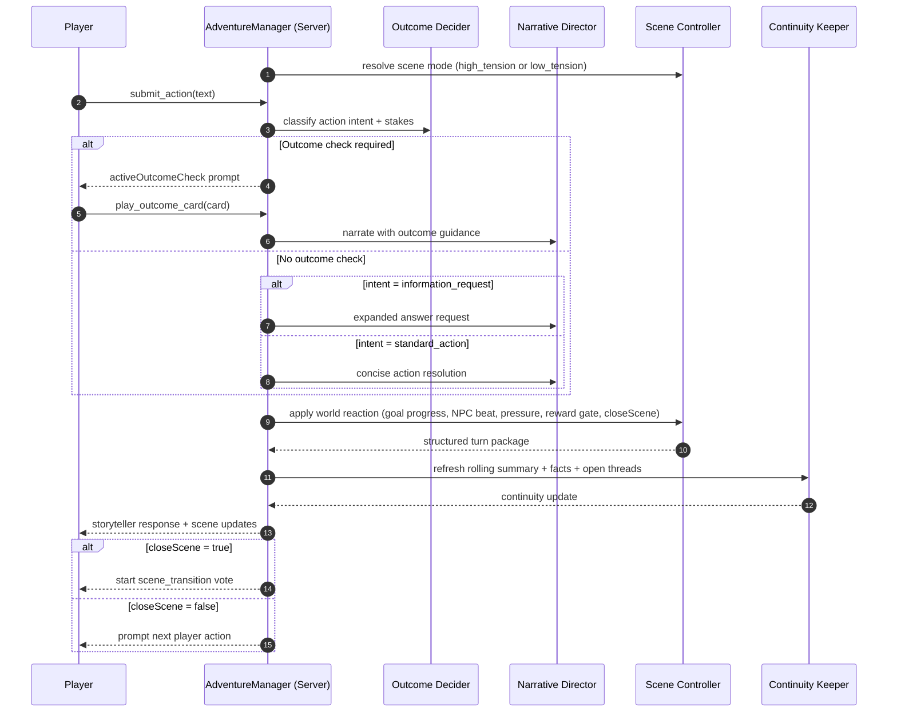
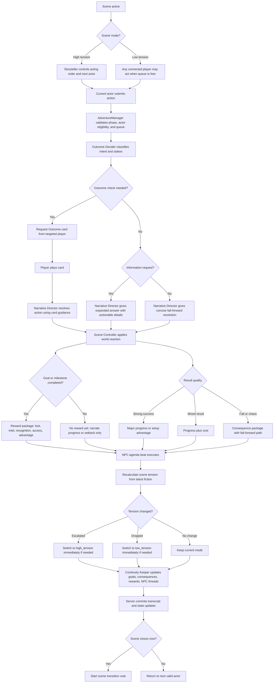

# 12 - Scene Loop Flow (Draft)

This flow chart defines the proposed play-phase turn loop to address:

1. Information-seeking actions should return concrete information (with longer output when needed).
2. Dangerous failed actions should apply visible negative consequences.
3. NPCs should act from their own agenda, not only react to player actions.
4. Rewards should be granted when goals are actually completed, not just when a single roll/card is strong.

---

## Agent Interaction Sequence

---

## Turn Decision Flow

---

## Outcome Interpretation Matrix (Narrative Layer)

| Outcome signal | Minimum narrative obligation |
| --- | --- |
| `success` | Advance objective; reward only if this completes a concrete goal or milestone. |
| `special-action` | Major breakthrough; usually strong progress, but reward still waits for completion gate. |
| `partial-success` | Progress plus meaningful cost or exposure. |
| `fumble` | Immediate setback with concrete consequence; fail forward. |
| `chaos` | Unstable twist that changes priorities and risk profile. |

Consequence examples (from Mighty Decks effect concepts): injury, distress, complication, movement hindrance, or environmental pressure.

Reward examples: useful loot, leverage, trustworthy intel, faction recognition, temporary advantage.

---

## Goal Completion Reward Gate

- Rewards are tied to completed fictional objectives or milestones.
- Strong outcomes can accelerate progress without immediately paying out loot or social rewards.
- If a player sets up a finishing move, payout happens on the finishing move when the objective actually resolves.

Example sequence:

1. Player uses `special-action` to strike an enemy: enemy is bloodied but still active.
2. No loot reward yet, because the enemy objective is not complete.
3. Next turn player uses `partial-success` to finish the enemy.
4. Reward now applies: loot from the enemy, plus a cost/complication if appropriate.

---

## Fail-Forward Constraint

- Failure must not dead-end mandatory progression.
- When an action fails at a required bottleneck, the story still advances, but with cost.
- Costs should be concrete: injury, distress, broken gear, time loss, noise, exposure, or NPC escalation.

Example sequence:

1. Player needs a tool to force a locked door.
2. Repeated `fumble` still allows discovery of a weak tool (progress path preserved).
3. Door is forced open, but tool breaks and player is injured.
4. Scene advances with consequences recorded for later turns.

---

## Tension Modes And Acting Order

- `high_tension`: Storyteller/Scene Controller determines turn order and resolves NPC turns between player turns.
- `low_tension`: players act more freely (queue-limited), and NPC beats trigger when fiction demands.
- Mode can switch mid-scene as pressure escalates or drops.
- NPC agenda beats are mandatory in both modes; only cadence changes.

---

## Dynamic Tension Shifts

- Tension is not fixed for the whole scene. It is recalculated after each resolved action and NPC beat.
- Escalation can happen immediately when fiction changes sharply.
- De-escalation can happen immediately when major threats are removed.

Escalation trigger examples:

1. A hidden player is discovered.
2. A new hazard appears or spreads (for example, fire in the house).
3. Players initiate violence (attack, sabotage, direct confrontation).
4. A time-critical clock jumps forward.

De-escalation trigger examples:

1. All active enemies are neutralized or routed.
2. Players reach temporary safety.
3. Major hazards are removed or contained.
4. Immediate pursuit pressure ends.

Mode switch rule:

- If escalation crosses high-tension threshold, switch to `high_tension` before the next actor is selected.
- If de-escalation drops below threshold, switch to `low_tension` before the next actor is selected.
- The switch is server-authored and visible to all clients through state updates.

---

## Notes For Next Implementation Step

- Keep this text-first: rewards and consequences can be represented in narration plus continuity facts; no new dashboard UI is required.
- Preserve server authority and FIFO action processing.
- Keep `Scene Controller` as the source of mode (`high_tension`/`low_tension`), NPC beats, and close/continue decisions.
- Keep `Continuity Keeper` responsible for persisting consequences and rewards as durable story facts.
