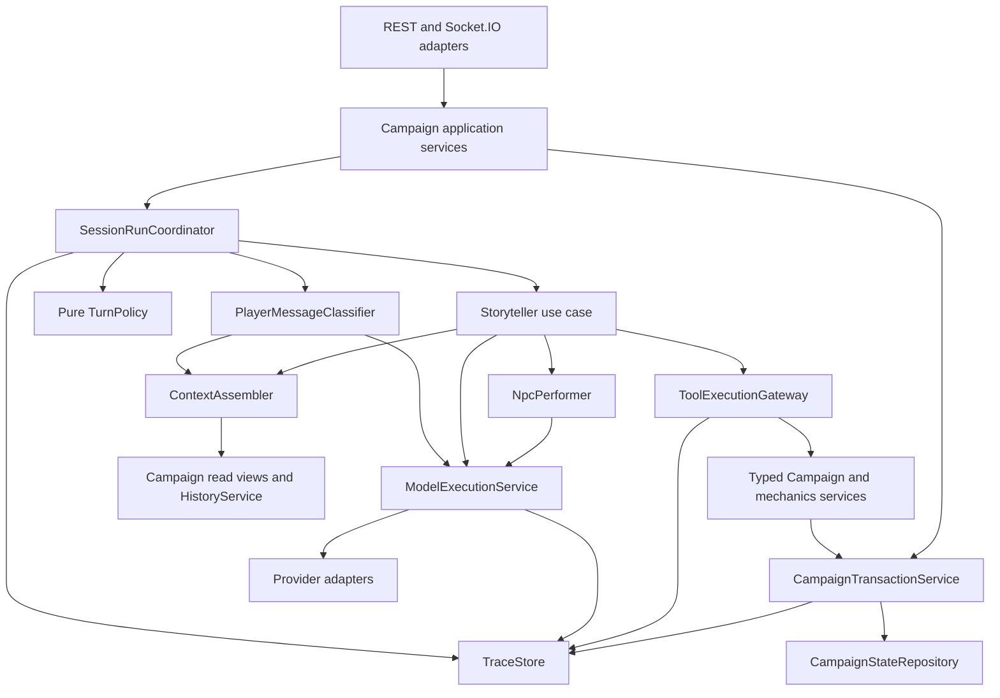
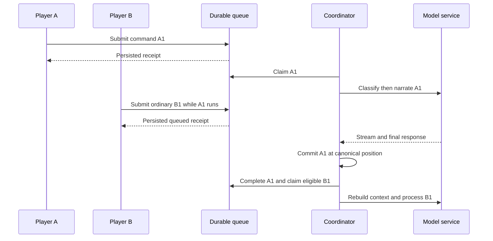
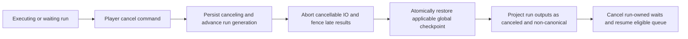

# MIG-21 — AI orchestration prototype architecture and implementation plan

Status: architecture foundation implemented in this repository; gameplay capabilities remain planned. Prepared 2026-10-05 against `4aae2a16292445b6d7c289d1b6992465fda76360`. No Linear changes are included in this document.

**Recommendation:** extend the Campaign domain with a small typed Session coordinator, Campaign-wide transactions/checkpoints, a shared model execution service, and append-only execution traces. Reuse content schemas, CRUD behavior, provider parsing, and Session presentation. Do not port the old `AdventureManager` or make the Workflow Lab executor the gameplay runtime.

**Evidence:** the Linear connector remains attached to `Dream Innovations`, but Mighty Decks browser access was restored during this review. Read the descriptions, acceptance criteria and expanded current dependency panels for all 23 prototype tickets in the [MIG backlog](https://linear.app/mighty-decks/team/MIG/all): MIG-5, 6, 7, 11–19, and 21–31. All are currently Backlog. Also inspected canceled MIG-20 and the visible duplicate status of MIG-10. MIG-1–4 are Linear onboarding tasks, outside the prototype. Section 9 records observed blockers separately from recommended changes. Read current relationship panels as authoritative; collapsed historical relationship activity is not treated as current state.

Decisions confirmed by the user during this review:

- One Session holds exclusive Campaign mutation authority while its run is executing **or waiting for a directed response**. Other Sessions may stay open read-only; authoring edits are allowed between runs.
- Enforce a strict repository-wide 350-line TS/TSX limit. Existing violations remain failures; there is no grandfathering or temporary no-growth baseline.

## 1. Requirements validation

The request is the governing product contract for this prototype. Older MVP material uses `Adventure` for a running game and excludes Campaigns/cards; that is historical scope, not the new design. Keep existing routes operational while implementing the new Campaign runtime through later vertical slices.

| Requirement | Verified existing state | Required disposition |
| --- | --- | --- |
| Adventure is source; Campaign is independent mutable copy | `CampaignStore.createCampaign` imports source content into a separate Campaign content store and writes source metadata | Retain; test independence in both directions and prohibit runtime source-store access |
| Session is one sitting; Campaign authoritative | Persisted Campaign Sessions exist; old AI Adventures are a separate domain | Attach AI to Campaign Sessions; do not alias a Campaign to `AdventureState` |
| No live source overlay | No such overlay is needed by current Campaign creation | Do not introduce one; source IDs are provenance only |
| Code-first orchestration | Existing TypeScript AI manager and generic Workflow Lab executor | Use explicit use-case services/state machines; no n8n or required React Flow |
| Small files and automated guard | 500 tracked TS/TSX files; 111 exceed 300 physical lines, 95 exceed 350 | Add strict guard in MIG-21; report existing debt honestly, split by responsibility later |
| Shared provider-independent execution | `TextCompletionClient`, model runners, workflow adapters, and portrait calls partially overlap | Consolidate through `ModelExecutionService`; provider transport belongs in adapters |
| Abstract presets, no routing | Existing role-specific model IDs and Workflow Lab slots/fallbacks | Four static global presets; snapshot resolved settings at run start; no capability router |
| Use-case prompt builders with provenance | Builders exist but concatenate instructions, context, and input to a string | Extract per use case; structured prompt sections survive request serialization |
| Classifier plus deterministic Outcome policy | Legacy model returns `shouldCheck`, then heuristics modify it | Replace with validated signals and separately versioned pure policy; no second adjudicator |
| One executing run per Session; FIFO ingress | Legacy busy gate rejects new actions; Campaign chat only appends transcript | Durable inbox and typed scheduler; ordinary messages accepted during a run |
| Directed responses and explicit interrupts | No Campaign correlation/pending-interaction protocol | Add typed request/response IDs and explicit interrupt field, never prose detection |
| Cancellation and global restore | Legacy snapshots cover old Adventure state, not Campaign content plus Session piles | Campaign transaction/checkpoint boundary; retained non-canonical output and immutable audit |
| Player control and availability | Session PC claims and boolean `connected`; payload-supplied identity | Bound participant identity, explicit availability, assigned NPC control, deterministic authorization |
| Minimal Outcome loop | Deck composition, card instances, hand/discard and multi-select transport exist | Reuse deck data; add directed single-card event, frozen stakes, transactional resolution and deterministic Catastrophe |
| Advanced staged card play | Current play handler immediately moves all submitted cards | Later `CardPlayIntent`; validate all-or-nothing, then atomically commit |
| Explicit metagame | Separate old-AI metagame handling exists | Campaign message mode; separate guidance, continuity correction, and validated mutation |
| NPC Performer | No matching constrained Campaign sub-agent | Narrow typed input projection, no gameplay tools or writes |
| Story History and periodic compaction | Old runtime refreshes a rolling summary through continuity LLM calls | Explicit `record_history`; periodic compaction at roughly 10 committed narrative messages |
| Individual component APIs | Actors, Assets, Counters, Locations, Encounters, Quests have typed routes/store methods | Retain and extract service ownership; add transactional Campaign-facing calls |
| Divergence and runtime stubs | Creation primitives exist, but authored caps and placeholder content constrain growth | Campaign-local generated stubs with stable IDs; no forced return to authored objective |
| Tool Registry/Gateway | Workflow “tool” mode is not a gameplay authorization gateway | Selected definitions, schema validation, capability enforcement, shared service calls |
| JSONL trace and expanded timeline | Two existing loggers; old diagnostics truncate/redact/best-effort; Lab has step events | New canonical `TraceStore`; reuse presentation ideas and IO patterns, not lossy semantics |
| Selective tests and manual real-model verification | Useful integration/provider/store tests exist | Add focused tests for boundaries and 2–3 opt-in model cases per AI capability; no coverage target |

Rules checked in the installed `@mighty-decks/components/docs/en/mighty-decks-rulebook.md`, which `RulesIndexPage.tsx` imports directly: obvious/safe actions do not need Outcomes; stakes precede selection; replacement follows resolution; Catastrophe is checked after drawing; all-Fumble starting hands redraw. The request's minimal loop moves the selected card to discard before narration; treat that move as tentative transaction state until resolution commits. This preserves the requested interaction order without making a failed resolution consume a card permanently.

## 2. Existing code assessment

### 2.1 Retain, extract, adapt, replace

Paths below are relative to the repository root. Line anchors refer to the inspected revision, not future edits.

| Code | Finding and disposition |
| --- | --- |
| `apps/server/src/persistence/CampaignStore.ts:175` | Retain snapshot-copy creation and source metadata. `importModule` writes copied index/fragments; runtime changes go to a store rooted at the Campaign directory. Artifact URLs may still reference shared media; copy semantics cover editable content, not necessarily image bytes. |
| `CampaignStore.ts:235` and `spec/campaign.ts` | Retain Session lifecycle and existing records. MIG-14 explicitly requires an AI Session participant: add participant `kind: human | ai` with server-managed AI identity and role `storyteller`. A Session selects human/AI storyteller mode separately from `mode: play | worldbuilding`; do not impersonate a human or require an AI socket. |
| `CampaignStore.ts:1320` and `:1616` | Session writes are serialized by **Campaign ID**, despite the lock's name. They clone Session state, rewrite the Campaign's `sessions.json`, then touch metadata. Useful precedent, not an atomic content+Session transaction. |
| `CampaignStore.ts:444` | Creating a PC writes content, claims it, then appends another Session event in separate operations. Failure can leave partial work; the final `seed` Session can also overwrite intervening Session changes. Move the compound operation into one transaction. |
| `CampaignStore.ts:1003` onward | Typed component methods already exist and delegate to a Campaign-rooted `AdventureModuleStore`. Extract five named domain services; avoid a second parallel CRUD implementation. |
| `apps/server/src/persistence/adventureModuleStore/{actors,assets,counters,locations,encounters}.ts` | Retain validators, stable fragment IDs, reference checks, and per-entity behavior. Separate pure mutation/projection from MDX/index persistence as each service moves behind transactions. |
| `adventureModuleStore/rollbacks.ts` | Best-effort rollback of individual file operations uses `Promise.allSettled`. It is not a crash-safe global game checkpoint. Do not expose it as Session revert. |
| `apps/server/src/campaign/registerCampaignRoutes.ts` | Typed REST content APIs exist. Route handlers call the store directly. Adapt to the same services/transaction authority used by tools, including authoring during play. |
| `apps/server/src/campaign/registerCampaignSocketHandlers.ts:64` | Broadcasts the same full Session to all subscribers. Hand/deck concealment is currently visual, not a server projection. Add participant-specific Session views before AI/debug payloads expand. |
| Same file, message/card handlers | Mutations forward payload participant IDs to store methods without binding each command to the socket's authenticated membership. A role check on a supplied ID is not proof of its sender. Introduce a server-bound guest principal/rejoin capability; no account system needed. |
| `spec/campaignEvents.ts` | Retain naming and typed Socket.IO contracts. Add separate AI commands with command IDs, run/interaction correlation, expected revisions, and structured errors. Do not reinterpret arbitrary group chat as card responses. |
| `spec/outcomeDeck.ts`, `CampaignStore.ts:513–633` | Retain twelve-card catalog, instance IDs and injectable shuffle. Existing card play validates duplicates/ownership of selected cards and mutates hand/discard, but does not establish stakes, resolve, replace, or check Catastrophe. |
| `apps/server/src/adventure/AdventureManager.ts:665` onward | Replace as the new-runtime owner. It rejects actions while busy, holds many phase/pacing/queue/state responsibilities, and works on legacy Adventure state. Keep the old routes working until a separate retirement ticket. |
| `apps/server/src/ai/StorytellerService.ts` | Extract useful parsing/provider behavior. Do not subclass or expand this 1,440-line facade. Its pitch/scene/Outcome/continuity/metagame/image responsibilities should not transfer wholesale. |
| `StorytellerService.ts:802`, `ai/storyteller/outcomeHeuristics.ts` | Existing classifier-style experiment is useful evidence and a source of fixtures. It produces direct decisions, repairs JSON, applies heuristics, then defaults to no-check if unavailable. Replace that failure behavior with explicit unclassified failure; no silent success-path guess. |
| `ai/storyteller/promptBuilders.ts` | Extract semantic instructions selectively. Remove old prompt pressure to keep a main objective playable and force closure by action counts; those conflict with player divergence. Preserve provenance rather than `composePrompt(...).join(...)`. |
| `ai/storyteller/modelRunners.ts` | Reuse usage/retry instrumentation concepts. Currently mixes text/image dependencies, returns `null` on failure, uses raw model IDs, and shortens logged text responses to 1,800 characters. Replace the public execution boundary and full trace behavior. |
| `ai/OpenRouterClient.ts`, `GroqClient.ts`, `ClaudeCliClient.ts` | Adapt transport, usage and stream parsers. Text requests are a single string; OpenRouter/Groq serialize it as a user message. Add real roles, tools, structured output, caller cancellation and capability reporting. Only implement adapters needed by selected presets first. |
| `ai/workflow/openRouterWorkflowAdapters.ts` | `withAbortRace` rejects the wrapper but does not forward the signal into underlying provider IO. Do not treat that as cancellation safety. Combine caller cancellation with timeout at the adapter, and fence all late callbacks. |
| `apps/server/src/image/CharacterPortraitService.ts` | Direct `TextCompletionClient` usage shows the shared-execution migration must include non-Storyteller call sites eventually. Do not add new provider bypasses. |
| `apps/server/src/workflow/{executor,types,WorkflowRunLogger}.ts` | Keep existing Lab/authoring experiments operational. Generic DAG/shared-state execution lacks the required gameplay authority/checkpoint semantics. Do not add a workflow engine dependency to the Session coordinator. |
| `apps/web/src/routes/WorkflowLabPage.tsx` | Reuse expanded event/timeline presentation ideas if useful; create a Campaign trace API/view over canonical events. Any future graph is a projection only. |
| `apps/server/src/diagnostics/AdventureDiagnosticsLogger.ts` | Legacy diagnostics are debug-gated, best-effort and image-redacting. Keep legacy behavior isolated; new runtime needs durable complete model payloads through `TraceStore`. |
| `apps/server/src/persistence/AdventureSnapshotStore.ts` | Retain for legacy recovery. It snapshots old Adventure runtime and trims history; it neither restores Campaign fragments nor supplies the new checkpoint contract. |
| `apps/server/src/utils/atomicFileWrite.ts` | Retain rename-with-retry behavior as a starting point. A rename protects one file, not multiple stores; durability flushing and interrupted-write recovery need explicit tests. |
| `apps/web/src/hooks/useCampaignSession.ts`, `CampaignSessionTranscriptFeed.tsx`, `components/session/*` | Retain route/session subscription and transcript/table presentation. Adapt command acknowledgments, queue position, explicit mode/interrupt controls, pending responses, stream status and cancellation. Split the hook by responsibility as it grows. |
| `apps/web/src/lib/campaignSessionIdentity.ts` | Local identity is currently keyed by Campaign slug, Session and role. Add stable IDs/rejoin credentials; renaming a slug must not silently create a new gameplay identity. |

### 2.2 Concrete architecture debt

Physical-line count includes blanks and comments. Largest relevant files: `AdventureManager.ts` 3,363; `CampaignStore.ts` 1,717; `StorytellerService.ts` 1,440; Workflow Lab `executor.ts` 1,092; `OpenRouterClient.ts` 629; Campaign routes 583; Campaign socket handlers 496; `spec/campaign.ts` 487; model runners 433; prompt builders 394. Tests also count: `adventureManager.integration.test.ts` 2,270 and `adventureModuleStore.test.ts` 2,063. These are hand-written code, not legitimate generated-file exceptions.

The authoring schemas impose caps such as 40 Actors/Locations and a Session transcript cap of 5,000 entries. Runtime-generated content must fail explicitly at limits; schema growth/pagination belongs to content/history tickets. Never silently drop facts or entries to fit these caps.

Asset **definitions**, Actor card composition and table card **references** are not an inventory ledger. A table entry pointing to an Asset is not enough to prove unique ownership or transfer conservation. Later gameplay mechanics need Asset instance IDs, ownership, Effect instances and references to their definitions. Reuse card presentation, not its display props as canonical mechanics.

### 2.3 Verification performed

- Read Campaign and old AI stores, orchestration, provider boundaries, representative CRUD modules, transports, schemas, UI hooks/presentation and relevant docs/rules.
- Inventoried tracked TS/TSX physical line counts; no guard is currently present and no `.github` workflow was found in this checkout.
- `pnpm check:agent` passed on the inspected baseline. Full output: `.agent-logs/check-agent.log`.
- Read all 23 active prototype Linear tickets through authenticated browser UI, including expanded dependency panels. Found stale n8n wording in MIG-27, message/run ambiguity in MIG-25, dependency gaps and acceptance milestones that need splitting; details in section 9.
- Existing tests include `campaignStore.test.ts`, `registerCampaignRoutes.test.ts`, `registerCampaignSocketHandlers.test.ts`, `campaignFlow.smoke.test.ts`, `adventureManager.integration.test.ts`, `storytellerService.test.ts`, `openRouterClient.test.ts`, `claudeCliClient.test.ts`, `adventureSnapshotStore.test.ts`, and `registerWorkflowLabRoutes.test.ts`.
- No gameplay tests or real model calls were run for this documentation review. Passing typecheck is not evidence that the proposed runtime behavior already works.

## 3. Open contradictions and gaps

### Resolved during this review

1. **Concurrent Campaign edits versus global rollback:** exclusive logical mutation authority belongs to one Session from run start through directed waits to commit/cancel. A short storage mutex is distinct from this persisted authority. Presence, ingress and audit still update while another run owns gameplay mutation authority.
2. **Strict size limit versus existing code:** the guard must report the 95 existing violations as failures. MIG-21 must not hide them in a baseline, exclude tests, or label hand-written catalogs as generated. Passing all repo checks is therefore a separate cleanup dependency, not a claim MIG-21 can make.
3. **Terminology and scope:** the explicit current request supersedes old MVP text. Campaign Sessions are the new integration point; no Adventure-to-Campaign live merge.

### Still requiring product or ticket clarification before the affected capability ships

| Gap | Proposed handling and architectural consequence |
| --- | --- |
| MIG-5 refers to “OpenRouter/Jev” without defining Jev | Treat this as an unresolved experiment/provider reference, not authorization for classifier-specific provider calls. Identify the intended package/service/model before the MIG-5 implementation; route it through MIG-24 regardless. This does not block the provider-independent architecture. |
| What persists between sittings? | Campaign entities, Effects, Asset ownership and Story History should persist. Existing Outcome piles/claims/table are Session-scoped and reinitialize each Session. Whether hands/decks and table placement carry across Sessions is a product decision; preserve Session scope until explicitly changed, do not accidentally reset Campaign Effects. |
| Who can release a permanently absent player's PC or assign NPC control? | Keep absence separate from disconnect. Recommend an explicit host/operator assignment command; never grant another player's PC through classification or automatically on disconnect. The exact authority for reassignment needs confirmation. |
| Catastrophe consequence scope in the first loop | Deterministic detection is required. Recommend narrating its crisis, discarding exactly triggering Fumbles and refilling, while typed Effects/Injuries remain deferred. If the ticket promises full mechanical consequences, split it; do not imply that detection alone implements the complete rule. |
| Minimal live-state correction versus arbitrary historical revert | Current-run cancel is precisely defined below. Reverting to a much older checkpoint also invalidates later canonical history and resolved commands; expose explicit preview/selection when that later capability is implemented. No per-player partial restore. |

Confirmed backlog contradictions requiring wording updates, without changing product intent: MIG-27 still says its registry must work from n8n, contrary to MIG-21/current direction; remove that criterion. MIG-25 says every new player message starts a distinct run, but directed replies must resume their originating run; apply that rule only to dequeued ordinary messages. MIG-13's “Adventure/Campaign content” means Campaign snapshot content during play, per MIG-23/MIG-26; no source lookup. MIG-14 explicitly excludes gameplay mutations, so stub creation, history tools and full divergence must not be smuggled into its first read-only happy path.

Implementation decisions made here, not questions: use Zod at boundaries; stable IDs over mutable slugs internally; one Node writer process; file-backed aggregate transactions; per-use-case prompt builders; explicit failure results; an import-graph guard rather than a framework; no automatic extra Storyteller call for uncertain classification.

## 4. Proposed technical architecture

### 4.1 Domain and dependency direction



All transport-facing/persisted contracts and shared service port types live in responsibility-focused `spec/*.ts` files. Implementations live in server folders. Runtime code may import typed Campaign ports, never source-Adventure authoring stores, HTTP route modules, React components, or filesystem persistence directly. The composition root is the only place allowed to wire concrete adapters.

Keep existing human Session transports compatible. Add typed AI commands such as `submit_campaign_ai_message`, `respond_campaign_interaction`, `submit_campaign_outcome`, and `cancel_campaign_run` in a dedicated `spec/aiSessionEvents.ts` when MIG-28/MIG-14 own their behavior. Responses include command receipts and participant-specific state/stream projections. A proposed operator read endpoint is `GET /api/campaigns/:campaignId/sessions/:sessionId/execution-events?afterSequence=...&runId=...`; it delegates to `TraceStore` and never shares the player broadcast channel. These routes/events are design-only in MIG-21.

An Adventure authoring service may intentionally edit source content. A Campaign factory may read source content once to create an independent copy. Runtime services receive no source-Adventure write port. Keeping the source ID on a Campaign does not authorize a lookup/merge during play.

### 4.2 Module ownership

These are responsibility boundaries, not a requirement to create one class or empty folder for every row in MIG-21.

| Proposed module | Responsibility and public interface | Main types/dependencies | Callers; forbidden knowledge |
| --- | --- | --- | --- |
| `campaign/runtime/SessionRunCoordinator` | Accept typed commands; schedule one run; drive explicit turn stages; cancel/interrupt/recover | `RunRecord`, `TurnPlan`, interaction state; queue, use cases, transactions, trace | Application adapters; no provider HTTP, JSX, raw storage or giant prompt strings |
| `campaign/runtime/SessionMessageQueue` | Durable command acceptance, FIFO order, dedup, priority eligibility, claim/complete dispositions | `PlayerCommand`, `QueueEntry`, admission sequence; repository transaction port | Coordinator/ingress; no prose classification or gameplay legality |
| `campaign/runtime/interactionReducer` | Pure legal transitions, pending request lifecycle, availability effects | `SessionInteractionState`, `PendingInteraction`, transition input/result | Coordinator; no IO or timers hidden inside reducer |
| `campaign/runtime/TurnPolicy` | Convert classified signals and authoritative control facts into a plan | `PlayerIntentSignals`, versioned `DecisionResult`, `TurnPlan` | Coordinator; no LLM, storage or prompt construction |
| `campaign/read/OrchestrationReadService` | Typed snapshot reads for Session, participants/control, Encounter, components, mechanics, rules and canonical recent/history data | `CampaignReadView`, existing entity DTOs; aggregate repository, history/rules ports | ContextAssembler, classifier and non-AI callers; no prompts, provider calls or source-Adventure fallback |
| `ai/useCases/playerIntent` | Minimal context, its prompt, model invocation, strict parse to signals | `PlayerMessageClassifier`; context/model ports | Coordinator; does not decide Outcome or mutate state |
| `ai/useCases/storyteller` | Narration, stakes, resolution, proposed directed requests/tool calls | `StorytellerPromptBuilder`, `NarrativeProposal`; context/model/gateway/NPC ports | Coordinator; no direct provider/storage access or implicit commit |
| `ai/useCases/npcPerformer` | Constrained proposed speech/reaction/action | `NpcPerceptionContext`, `NpcProposal`; model port only | Storyteller; no whole Campaign snapshot, tools, mutations or coordinator access |
| `ai/context/ContextAssembler` | Obtain named sections at one read revision; filter by audience/subject; deterministic budget/order | `ContextSection`, `ContextManifest`; typed read/history/rules sources | Use cases; no universal prompt, model routing, or raw source-Adventure context |
| `ai/prompts/<UseCase>PromptBuilder` | Pure role/section assembly for its use case | `PromptDocument`, use-case input | Owning use case; no provider serialization, state reads or writes |
| `ai/execution/ModelExecutionService` | Resolve static preset, deadline/retry budget, stream capture, usage, typed errors | `ModelPreset`, `ModelRequest`, `ModelResult`; adapters/trace | Every Mighty Decks AI feature; no gameplay policy or tools executed automatically |
| `ai/providers/*` | Serialize provider messages/tools, parse responses/stream, honor cancellation | Provider request/result contracts | Execution service only; no Campaign state, prompts, decisions or storage |
| `campaign/state/CampaignTransactionService` | Logical mutation lease, optimistic revision checks, atomic aggregate writes/checkpoints/restore | Campaign aggregate, revision, checkpoint, mutation receipt | Domain services/coordinator; no model calls inside storage lock |
| `campaign/content/{Actor,Asset,Encounter,Counter,Location}Service` | Individual typed CRUD and domain validation; lightweight stub creation | Existing component DTOs adapted to Campaign IDs; transaction port | REST, CLI, tools, runtime content use case; no provider calls or source writes |
| `campaign/mechanics/OutcomeService` | Card-instance conservation, directed single selection, refill, pure Catastrophe detection | Piles, typed selection, frozen action/stakes; transaction port and injected random source | Coordinator and later card gateway; no narration or text parsing |
| `campaign/mechanics/CardPlayService` (later) | Stage intent, evaluate proposal, validate and commit whole intent | `CardPlayIntent`, legality result, revision | Coordinator/tools; no partial acceptance of illegal intent |
| `campaign/history/StoryHistoryService` | Append explicit chronological facts, canonical filtering, compaction cursor and correction records | Fact/message IDs, canonical positions, compaction records | `record_history` tool/context/coordinator; no per-turn extraction LLM |
| `ai/useCases/historyCompaction` | Build compaction prompt and validate candidate summary at a frozen cursor | History input/model port; returns summary proposal | History maintenance; cannot replace raw history or rewind gameplay |
| `campaign/tools/ToolRegistry` | Register typed schemas and capability metadata; return selected immutable tool set | `ToolDefinition`, version | Composition root/use cases; no provider schema or mutable game state |
| `campaign/tools/ToolExecutionGateway` | Revalidate selection, authority, input/output, revision, idempotency; trace service calls | Tool execution request/result; registry/domain ports | Storyteller; no direct file IO or arbitrary model-selected services |
| `observability/TraceStore` | Append/query/flush full canonical event records | `ExecutionEvent`, stable event IDs and ordered sequence | All instrumented boundaries; no gameplay decisions or React Flow |
| `persistence/campaignState/*` | Schema migration, atomic file publication, checkpoint files, trace outbox recovery | Versioned aggregate and repository port | Transaction service; no provider/UI or use-case policy |
| `apps/web/.../executionTimeline` (later) | Chronological expansion, causal navigation, canceled/superseded markers | Trace read DTOs | Operator debug route; no canonical writes or execution semantics |

### 4.3 Why this approach

1. **Recommended: typed coordinator plus reusable services.** Fits existing TypeScript/Socket.IO and exposes reusable boundaries without inventing graph execution. A Session reducer, deterministic policy and transaction service are enough.
2. **Extend `AdventureManager`.** Appears faster initially, but imports incompatible state, failure, prompt and queue semantics and deepens the largest god object. Reject for new Campaign runtime.
3. **Promote Workflow Lab to canonical engine.** Reuses graphs and traces but requires durable continuations, transaction authority and gameplay permissions that its shared-state DAG does not provide. More abstraction work than a small state machine. Retain as an independent experiment only.

### 4.4 Classifier and policy

The classifier returns separate signals, not a single all-purpose intent enum. Minimal context includes acting Actor/control assignments, current public Encounter facts, recent canonical conversation and relevant constraints. More expensive context follows the policy's selected needs. The current player input remains an explicit user section.

Initial policy `outcome-v1` is an experiment, not a claim of calibrated probabilities: request an Outcome when an actionable attempt has uncertainty, meaningful consequence or reward, and `outcomeCandidate >= 0.65`. Explicit metagame, no actionable attempt, or established safe/trivial action do not request a card. Threat is evidence, not a mandatory condition: social opportunities and high-reward uncertainty can also qualify. Record exact inspected signals, threshold, rule version and selected branch. Tune from the three real-model cases, not intuition alone.

Control authorization is deterministic and precedes execution: the submitted acting Actor must be the player's PC or an assigned NPC. A classifier's suspicion that prose authors someone else's PC yields a correction/clarification response, never permission. A malformed classifier response is an execution error, not `outcomeCandidate=0`. Low confidence in an otherwise valid response is logged and evaluated with the same initial policy; no extra adjudication call or hidden confidence split.

### 4.5 Context, prompts, and model execution

Section IDs must be request-unique; source references include Campaign/entity IDs, source revision and visibility. Keep section content, estimated token count/estimator version, ordering, priority and any truncation metadata. Never trim the acting input, frozen stakes or exact Outcome silently. If required sections exceed the budget, fail with a context-limit result; trim optional sections deterministically and record what was omitted.

Prompt builders return system instruction parts, user input parts, context references and selected tool definitions. The model service records both that provenance-rich document and the exact serialized provider request body, excluding authentication transport headers from the data model. Adapters may flatten for a provider that requires it only if they preserve an offset/message mapping back to section IDs. No content redaction or response shortening in development traces.

Initial presets: `fastCheapProse`, `fastOrchestrator`, `smartThinker`, `fastVisionProse`. Mighty Decks owns a versioned development configuration at proposed `apps/server/config/ai-model-presets.json`, mapping each to provider/model/settings including provider-supported reasoning/effort options. This file contains no credentials; retain environment-configured API keys. Call sites select IDs, never provider model strings. Persist the resolved configuration with each run and request. Preset capability checks reject unsupported tools/vision/structured output rather than silently losing them. Retries target the same configured model; do not carry the legacy fallback chain into a new implicit router. Runtime config changes affect subsequent runs, not an in-progress run's reproducibility. Record request latency, time to first token and first meaningful player-visible text separately: MIG-14's roughly three-second target includes classifier/context overhead, not just provider TTFT.

Provider attempts have a bounded shared deadline and retry count. Partial streams from different attempts have separate output/attempt IDs; retries do not concatenate contradictory text. Canceled/timed-out attempts can still return provider data: append it to audit as late/discarded, but gate UI publication, tools and commits by run generation.

### 4.6 Content, tools, NPCs, and history

Campaign component IDs are stable fragment/entity IDs scoped by Campaign, not globally unique names. Existing slugs remain navigation aliases. Once runtime generation is enabled, named NPCs/Locations/Encounters must produce a typed content proposal before their narration becomes canonical; the coordinator creates at least a stub in the same run transaction. MIG-14 is explicitly read-only gameplay: its pilot fixtures use existing components and do not claim full divergence support. MIG-26 provides reusable stub CRUD; MIG-18 integrates generated proposals/stubs after transactions are available. This does not require the entire board-tool suite.

Tool definitions are a selected allowlist per call, not the whole registry. Model output can only propose calls; the gateway rechecks tool version, input/output schemas, actor/Campaign permission, idempotency and revision. Tool mutations affect the run's tentative aggregate. External non-reversible effects are not allowed as initial gameplay tools.

NPC context is constructed by an explicit allowlist: location, perceivable facts, known/remembered/believed facts, wants, voice, relationship, and current statement/action. Visibility labels alone are insufficient; a fact public to players is not necessarily known by an NPC. Start unknown NPC knowledge as empty rather than passing all Campaign facts and trusting a prompt. NPC output is a proposal returned to the Storyteller.

Story History stores chronological natural-language facts with authoring run/tool IDs and canonical position. The Storyteller explicitly proposes `record_history`; validate/commit facts with the run. Compaction runs around ten **committed narrative messages**, counting player in-fiction messages incorporated into a committed turn and committed Storyteller messages; exclude system messages, stream chunks, metagame and canceled/superseded messages. Configure the threshold.

At compaction, freeze fact/message cursors, compact the previous summary plus accumulated explicit Story History facts through that checkpoint, and preserve raw inputs. Narrative-message count is the trigger and boundary; do not turn the compactor into a second extractor over all transcript text. Subsequent context includes the latest valid compacted history, newer explicit facts, and uncompacted canonical narrative messages after the cursor. Do not drop facts recorded since the last compaction or duplicate old transcript alongside the summary. Compaction failure leaves the old summary/cursors unchanged. A correction/revert invalidates summaries covering removed canon; choose a prior valid summary and rebuild later. No second post-turn fact extraction call or knowledge graph.

### 4.7 Optional React Flow migration

MIG-22 maps a run's spans and `RuntimeStepKind` to visual nodes, with `parentSpanId`/causation links as edges and event status as highlights. Context nodes show section provenance; model nodes show the resolved preset/request; wait/checkpoint nodes refer to persisted interaction/checkpoint IDs. Begin read-only. Any eventual cancel/resume/edit control sends the same validated application command as other clients; it cannot mutate a graph object and thereby change game state. An editor may later edit a supported configuration or prompt version, but there is no graph-to-runtime execution compiler in this plan. Removing React Flow must leave both runtime and JSONL traces usable.

## 5. Key TypeScript contracts

These are representative **design sketches**, not compiled source added by MIG-21. Entity DTOs below refer to the existing typed schemas adapted to Campaign IDs. Runtime validation must mirror discriminated unions; introducing a type alone does not validate network/provider/file input.

### 5.1 Identity, commands, queue, and interactions

```ts
type Id<K extends string> = string & { readonly __kind: K };
type CampaignId = Id<"campaign">;
type SessionId = Id<"session">;
type ParticipantId = Id<"participant">;
type ActorId = Id<"actor">;
type RunId = Id<"run">;
type CommandId = Id<"command">;
type InteractionId = Id<"interaction">;
type CheckpointId = Id<"checkpoint">;
type EventId = Id<"event">;
type ModelCallId = Id<"model-call">;
type ToolCallId = Id<"tool-call">;
type Revision = number;
type CanonicalPosition = { branchId: string; commit: number };

interface SessionScope { campaignId: CampaignId; sessionId: SessionId }
interface PlayerMessage extends SessionScope {
  commandId: CommandId;
  participantId: ParticipantId; // Bound/verified by ingress, not trusted payload.
  actorId: ActorId;
  mode: "in_character" | "metagame"; // MIG-31 wire names; UI may say “In fiction”.
  text: string;
  interrupt: boolean;
  replyTo?: InteractionId;
}
type PlayerCommand =
  | { kind: "message"; message: PlayerMessage }
  | { kind: "outcome_selected"; commandId: CommandId;
      interactionId: InteractionId; runId: RunId; participantId: ParticipantId;
      cardId: string; expectedGameRevision: Revision }
  | { kind: "cancel_run"; commandId: CommandId; runId: RunId;
      participantId: ParticipantId };

interface QueueEntry {
  command: PlayerCommand;
  admissionSequence: number;
  status: "queued" | "claimed" | "completed" | "canceled" | "stale";
  priority: "ordinary" | "interrupt" | "directed";
  basedOn: CanonicalPosition;
  runId?: RunId;
}
interface SessionMessageQueue {
  accept(scope: SessionScope, command: PlayerCommand): Promise<CommandReceipt>;
  claimNext(scope: SessionScope, expectedRevision: Revision): Promise<QueueEntry | null>;
  // Claims/dispositions are persisted through the same aggregate transaction.
}

type PlayerAvailability = "active" | "temporarily_unavailable" | "left";
type SceneInteractionPolicy =
  | { kind: "free" }
  | { kind: "turn_based"; actorOrder: ActorId[]; activeActorId: ActorId;
      interruptionWindow: string | null };
interface FrozenAction {
  messageId: string; actorId: ActorId; text: string; stakes: string;
  establishedAt: CanonicalPosition; gameRevision: Revision;
}
type PendingInteraction = {
  id: InteractionId; runId: RunId; participantId: ParticipantId;
  generation: number; createdAtIso: string;
  status: "pending" | "answered" | "canceled";
} & (
  | { kind: "text"; question: string }
  | { kind: "outcome_card"; action: FrozenAction; allowedCardCount: 1 }
  | { kind: "card_play"; action: FrozenAction } // Later advanced capability.
);
type SessionInteractionState =
  | { kind: "free" }
  | { kind: "processing"; runId: RunId; stage: TurnStage }
  | { kind: "waiting"; runId: RunId; pending: PendingInteraction }
  | { kind: "interrupted"; suspendedRunId: RunId; interruptCommandId: CommandId }
  | { kind: "canceling"; runId: RunId; checkpointId: CheckpointId }
  | { kind: "canceled"; runId: RunId; restoredTo: CanonicalPosition }
  | { kind: "recovery_required"; reason: string };
// Session setup/active/closed and player availability are separate state axes.
```

`CommandReceipt` contains command ID, duplicate/accepted/rejected disposition, admission sequence and a typed error. A repeated ID with identical payload returns the original receipt; the same ID with different content is rejected. Pending IDs are never reused after restore/replan. A cancel is a priority control command, not a queued narrative message.

### 5.2 Coordinator, classification, and pure decisions

```ts
type TurnStage = "classify" | "decide" | "assemble" | "narrate"
  | "establish_stakes" | "resolve_outcome" | "commit";
interface RunRecord extends SessionScope {
  runId: RunId; commandId: CommandId; generation: number;
  checkpointId: CheckpointId; startedAt: CanonicalPosition;
  status: "running" | "waiting" | "interrupted" | "completed"
    | "canceled" | "failed" | "superseded";
  stage: TurnStage; presetConfigVersion: string;
  resumedFromRunId?: RunId;
}
interface SessionRunCoordinator {
  accept(scope: SessionScope, command: PlayerCommand): Promise<CommandReceipt>;
  drain(scope: SessionScope): Promise<void>;
  recover(scope: SessionScope): Promise<void>;
}
interface PlayerIntentSignals {
  interactionType: "action" | "speech" | "question" | "other";
  actionableIntent: string | null;
  targetActorIds: ActorId[];
  attemptsOtherPcControl: boolean;
  outcomeCandidate: number; // Runtime schema: finite 0..1.
  threat: boolean; uncertainty: boolean;
  meaningfulConsequence: boolean; meaningfulReward: boolean;
  contextNeeds: ContextKind[];
  responseDepth: "brief" | "normal" | "extended";
  confidence: number; // Recorded signal, not an extra routing policy yet.
}
interface PlayerMessageClassifier {
  classify(input: ClassificationInput, call: RunCallContext):
    Promise<Result<PlayerIntentSignals, ClassificationError>>;
}
interface DecisionResult<B extends string> {
  policyId: string; policyVersion: string;
  inputs: Readonly<Record<string, JsonValue>>;
  thresholds: Readonly<Record<string, number>>;
  branch: B; reason: string;
}
type TurnPlan =
  | { kind: "narrate"; needs: ContextKind[]; depth: string }
  | { kind: "answer_rules"; needs: ContextKind[] }
  | { kind: "npc_reaction"; npcId: ActorId; needs: ContextKind[] }
  | { kind: "request_outcome"; actorId: ActorId; needs: ContextKind[] }
  | { kind: "clarify_control"; reason: string }
  | { kind: "metagame"; needs: ContextKind[] }
  | { kind: "no_op"; reason: string };
interface TurnPolicy {
  decide(input: PolicyInput): {
    decisions: DecisionResult<string>[]; plan: TurnPlan;
  }; // Synchronous/pure. PolicyInput includes authoritative ownership.
}
```

### 5.3 Context and prompt provenance

```ts
type ContextKind = "encounter" | "actor" | "npc" | "mechanics" | "table"
  | "outcome" | "history_summary" | "history_facts" | "recent_messages"
  | "rules" | "campaign_content" | "preferences";
interface ContextSection {
  id: string; kind: ContextKind;
  source: { service: string; kind: string; campaignId?: CampaignId;
    entityIds: string[]; revision: string };
  visibility: "player" | "storyteller" | "npc_specific";
  audienceActorId?: ActorId;
  content: string;
  estimatedTokens: number; estimatorVersion: string;
  priority: "required" | "preferred" | "optional"; order: number;
}
interface ContextManifest {
  at: CanonicalPosition; gameRevision: Revision;
  sections: ContextSection[];
  omissions: { sectionId: string; reason: string }[];
}
interface ContextAssembler {
  assemble(request: ContextRequest, view: CampaignReadView): Promise<ContextManifest>;
}
interface OrchestrationReadService {
  open(scope: SessionScope, runId?: RunId): Promise<CampaignReadView>;
  session(view: CampaignReadView): SessionReadDto;
  controlledActors(view: CampaignReadView, player: ParticipantId): Actor[];
  encounter(view: CampaignReadView): Encounter | null;
  recentNarrative(view: CampaignReadView, limit: number): NarrativeMessage[];
  history(view: CampaignReadView): HistoryContext;
  // Typed component get/list reads use the same view/revision.
}
interface PromptPart {
  id: string; text: string;
  source: { kind: "template"; id: string; version: string }
    | { kind: "player_input"; messageId: string }
    | { kind: "context"; sectionId: string };
}
interface PromptDocument {
  builder: { id: string; version: string };
  messages: { role: "system" | "user" | "assistant" | "tool";
    parts: PromptPart[]; toolCallId?: ToolCallId }[];
  context: ContextManifest;
  tools: ToolDefinition[]; // The exact selected definitions and versions.
}
interface PlayerIntentPromptBuilder {
  build(input: ClassificationInput, context: ContextManifest): PromptDocument;
}
interface StorytellerPromptBuilder {
  build(input: StorytellerInput, context: ContextManifest,
    tools: ToolDefinition[]): PromptDocument;
}
// NpcPerformerPromptBuilder and HistoryCompactionPromptBuilder own their inputs.
```

A serialized request retains a map from message/part offsets to prompt-part IDs; trace stores the source manifest as well as provider payload. Both exact included content and omitted sections are inspectable.

### 5.4 Models and adapters

```ts
type ModelPresetId = "fastCheapProse" | "fastOrchestrator"
  | "smartThinker" | "fastVisionProse";
interface ModelPreset {
  id: ModelPresetId; configVersion: string;
  provider: string; model: string;
  settings: { temperature: number; maxOutputTokens: number;
    timeoutMs: number; retryCount: number; inputTokenBudget: number };
  providerOptions?: Readonly<Record<string, JsonValue>>; // Validated by adapter.
}
interface ModelRequest {
  callId: ModelCallId; correlation: RunCorrelation;
  presetId: ModelPresetId; prompt: PromptDocument;
  response: { kind: "text" } | { kind: "json"; schemaId: string; schema: JsonValue };
  signal: AbortSignal; deadlineAtMs: number;
}
interface ModelExecutionService {
  execute(request: ModelRequest,
    onDelta?: (event: ModelStreamDelta) => void): Promise<ModelResult>;
}
type ModelResult =
  | { ok: true; text: string; toolCalls: ProposedToolCall[];
      usage: ModelUsage; resolvedPreset: ModelPreset }
  | { ok: false; error: ModelError; resolvedPreset: ModelPreset };
type ModelError = { kind: "timeout" | "canceled" | "unavailable"
  | "rate_limit" | "invalid_response" | "unsupported_capability";
  message: string; retryable: boolean };
interface ProviderAdapter {
  readonly providerId: string;
  readonly capabilities: { vision: boolean; tools: boolean; jsonSchema: boolean };
  prepare(request: ResolvedModelRequest): PreparedProviderRequest;
  execute(request: PreparedProviderRequest, signal: AbortSignal,
    onDelta: (delta: ProviderDelta) => void): Promise<ProviderResult>;
}
// prepare is pure. PreparedProviderRequest contains auditable body/mapping;
// credentials are injected privately by execute, never in a prompt or preset.
```

Use discriminated results rather than `null` plus an optional log. Each provider attempt has a fresh attempt ID under one logical model call. Adapter output types represent tool calls independently of any provider's function schema.

### 5.5 Transactions, checkpoints, and typed CRUD

```ts
interface Checkpoint {
  id: CheckpointId; campaignId: CampaignId; ownerSessionId: SessionId;
  beforeRunId: RunId; at: CanonicalPosition; schemaVersion: number;
  snapshotRef: string; contentHash: string;
}
interface CampaignTransactionService {
  beginRun(scope: SessionScope, runId: RunId): Promise<Checkpoint>;
  read(scope: SessionScope, runId?: RunId): Promise<CampaignReadView>;
  apply(command: CampaignMutationCommand): Promise<MutationReceipt>;
  commitRun(runId: RunId, expectedGameRevision: Revision): Promise<CommitReceipt>;
  restore(input: { checkpointId: CheckpointId; runId: RunId;
    reason: "cancel" | "failure" | "interrupt" | "metagame" }): Promise<RestoreReceipt>;
}
interface MutationContext {
  campaignId: CampaignId; runId?: RunId;
  principal: AuthorizedPrincipal; expectedGameRevision: Revision;
  commandId: CommandId; correlation: RunCorrelation;
}
interface CampaignActorService {
  get(view: CampaignReadView, id: ActorId): Actor | null;
  list(view: CampaignReadView, query: ActorQuery): Actor[];
  create(ctx: MutationContext, input: CreateActor): Promise<ActorMutationReceipt>;
  update(ctx: MutationContext, id: ActorId, patch: UpdateActor): Promise<ActorMutationReceipt>;
  delete(ctx: MutationContext, id: ActorId): Promise<MutationReceipt>;
}
interface CampaignAssetService {
  get(view: CampaignReadView, id: AssetId): Asset | null;
  list(view: CampaignReadView): Asset[];
  create(ctx: MutationContext, input: CreateAsset): Promise<AssetMutationReceipt>;
  update(ctx: MutationContext, id: AssetId, patch: UpdateAsset): Promise<AssetMutationReceipt>;
  delete(ctx: MutationContext, id: AssetId): Promise<MutationReceipt>;
}
// CampaignEncounterService, CampaignCounterService and CampaignLocationService
// each expose their own get/list/create/update/delete with their own DTOs.
// CounterService additionally owns changeValue, with range/invariant checks.
// Asset transfer later uses AssetInstanceId/fromActorId/toActorId atomically;
// it does not edit only the recipient or infer ownership from table cards.
```

Existing `AdventureModuleResolved*` DTOs are reusable shapes, not evidence that runtime should depend on source-Adventure storage. Keep entity schemas shared while separating repositories and mutation authority. All five concrete service interfaces are committed with their respective later extraction tickets; do not ship an untyped `updateComponent` escape hatch.

Checkpoint snapshots cover Campaign content/index/fragments, mechanics instances and ownership, all affected Session piles/table, canonical history pointers/preferences, and run-owned pending interactions. They exclude audit/raw message deletion, transport sockets, new input receipts, and current connectivity. Restore runs under the Campaign lock and reattaches current non-revertible control state, so it cannot lose messages received after the checkpoint or resurrect a disconnected socket.

### 5.6 Tool registry and gateway

```ts
interface ToolDefinition {
  id: string; version: string; title: string; description: string;
  inputSchema: JsonValue; outputSchema: JsonValue; // Provider-neutral JSON Schema.
  capabilities: string[];
  mutation: "read" | "campaign_transaction";
  permittedCallers: ("storyteller" | "operator")[];
}
interface ToolRegistry {
  list(): readonly ToolDefinition[];
  select(ids: readonly string[], principal: AuthorizedPrincipal): readonly ToolDefinition[];
  get(id: string, version: string): RegisteredTool | undefined;
}
interface ToolExecutionRequest {
  callId: ToolCallId; idempotencyKey: string; toolId: string; toolVersion: string;
  input: JsonValue; correlation: RunCorrelation;
  principal: AuthorizedPrincipal; expectedGameRevision: Revision;
  selectedToolSetId: string;
}
type ToolExecutionResult =
  | { ok: true; output: JsonValue; mutationId?: string }
  | { ok: false; error: "not_exposed" | "forbidden" | "invalid_input"
      | "invalid_output" | "stale_revision" | "execution_failed"; message: string };
interface ToolExecutionGateway {
  execute(request: ToolExecutionRequest): Promise<ToolExecutionResult>;
}
```

Implementation registration pairs each tool with typed Zod input/output validators and a typed handler. `JsonValue` is only the serialized envelope; validation narrows it before dispatch. Registry metadata describes schema/capability, while domain services enforce invariants. Output validation must occur before publishing a staged mutation; an invalid handler output cannot leave half a committed tool operation.

### 5.7 Execution events and trace port

```ts
type RuntimeStepKind = "trigger" | "classifier" | "decision" | "context"
  | "prompt" | "model_call" | "tool_call" | "wait" | "queue"
  | "interrupt" | "checkpoint" | "restore" | "output";
interface RunCorrelation extends SessionScope {
  runId?: RunId; commandId?: CommandId;
  spanId: string; parentSpanId?: string; causationEventId?: EventId;
  modelCallId?: ModelCallId; toolCallId?: ToolCallId;
  interactionId?: InteractionId; checkpointId?: CheckpointId;
}
interface EventPayloads {
  "message.received": { message: PlayerMessage };
  "message.queued": { commandId: CommandId; admissionSequence: number; lane: string };
  "run.started": { run: RunRecord };
  "decision.recorded": DecisionResult<string>;
  "context.assembled": ContextManifest;
  "model.requested": AuditableModelRequest;
  "model.delta": ModelStreamDelta;
  "model.completed": AuditableModelResponse;
  "state.committed": CommitReceipt;
  "state.restored": RestoreReceipt;
  "run.canceled": { reason: string; nonCanonicalOutputIds: string[] };
  // Add the remaining typed payloads in section 7 with their implementing slices.
}
type ExecutionEvent = {
  [K in keyof EventPayloads]: {
    schemaVersion: 1; eventId: EventId; sequence: number; atIso: string;
    type: K; step: RuntimeStepKind; correlation: RunCorrelation;
    canonicalPosition?: CanonicalPosition; payload: EventPayloads[K];
  }
}[keyof EventPayloads];
interface TraceStore {
  append(event: ExecutionEvent): Promise<void>; // Idempotent by eventId.
  read(query: { campaignId: CampaignId; sessionId?: SessionId;
    runId?: RunId; afterSequence?: number; limit: number }): Promise<TracePage>;
  flush(campaignId: CampaignId): Promise<void>;
}
```

The conceptual vocabulary labels events/spans; there is no serializable executable node graph. Audit explanations record policy reasons and returned provider data, not an assumption that every model exposes internal reasoning.

## 6. State and sequence flows

### 6.1 Scheduling invariants

- Persist and acknowledge ingress before processing. FIFO uses server admission sequence, not client clocks.
- Only one executing Storyteller run per Session. A Campaign additionally has one logical mutation owner across Sessions, retained during directed waits.
- Cancellation is handled first as a control operation. Among eligible narrative work: interrupts, matching directed replies, then ordinary FIFO. Responses required to complete the active interrupt belong to that interrupt's wait; they are not mistaken for ordinary parent responses.
- An ordinary message never resumes a wait unless it names the matching interaction ID and comes from the requested participant. A card reply must be the typed card command with the exact card instance ID.
- A Session waiting for a particular participant accepts ordinary messages into FIFO but does not run them. Multiple interrupts use FIFO within their priority lane. Revalidate eligibility after every safe boundary; rate-limit excessive submissions visibly rather than dropping/reordering silently.
- `connected` describes transport. Explicit availability is separate. Disconnect pauses a directed wait; it does not release the PC, choose a card, or make an NPC of the PC. Permanently leaving cancels the affected pending turn and restores it; ordinary messages from a left participant become stale. Other participants can cancel a blocked run.
- `SceneInteractionPolicy` separately represents free versus turn-based eligibility. Queue admission is not authorization to take a turn. Before claiming an entry, a pure eligibility check uses the active Actor, assignments and current interruption opportunity. Off-turn ordinary actions remain queued with a visible reason; temporarily unavailable players cannot execute until restored. Ability rules supply interruption eligibility through a policy port, not hardcoded Stunt names in the queue.
- Commands waiting for another Session's Campaign authority are durable and visibly blocked. Edits between runs use the same short transaction lock and expected revision; a new run never reads half an authoring save.



### 6.2 Normal turn


`run.started` includes the checkpoint and config version. The input is stored when received, but only incorporated messages and committed outputs enter future normal narrative context. Pending queue messages must not leak into the current turn's prompt merely because they are visible in chat.

### 6.3 Directed response

| Transition | Persisted action |
| --- | --- |
| Processing → waiting | Save continuation stage, run/checkpoint/generation, exact question, participant and new interaction ID; retain Campaign authority |
| Ordinary message during wait | Append ingress/transcript as pending; queue without resolving the wait |
| Matching response | Verify sender, interaction state/generation and command ID; mark answered exactly once; resume same logical run |
| Wrong player, wrong response type, old interaction | Reject with a typed reason; no mutation and no fallback to ordinary gameplay |
| Player unavailable | Keep wait and show blocked participant; no invisible timeout-based choice |
| Cancel | Cancel all pending interactions owned by that run and restore checkpoint |

Continuation is serialized data plus a stage enum, not a captured JavaScript closure or suspended Promise. No provider deadline remains active while waiting for a human.

```mermaid
sequenceDiagram
  participant P as Requested player
  participant C as Coordinator
  participant S as Campaign transaction service
  participant M as Model service
  C->>S: Begin run and persist checkpoint
  C->>M: Establish stakes
  M-->>C: Stakes proposal
  C->>S: Persist frozen action and card interaction
  C-->>P: Request interaction I1
  alt Valid card reply
    P->>C: outcome_selected(I1, cardId, commandId)
    C->>S: Validate and tentatively move card
    C->>M: Resolve frozen action, stakes and exact Outcome
    M-->>C: Resolution
    C->>S: Replace, check Catastrophe, commit
  else Any player's cancellation
    P->>C: cancel_run(runId, commandId)
    C->>S: Fence generation and restore checkpoint
    C-->>P: Output canceled; I1 invalidated; queue resumes
  end
```

### 6.4 Minimal Outcome turn


The selection is not reconstructed from transcript text or a shortcode. Stakes and action are frozen, and the resolution request receives exact Outcome metadata. Duplicate card commands return the prior receipt. A failed/canceled run returns the selected card through global restore, not a per-player compensation that risks duplication.

Implement starting all-Fumble redraw and empty-deck reshuffle with the minimal deck service; they are small deterministic setup/draw rules, not advanced Stunt legality. Use the existing twelve-card distribution. For Catastrophe, check after resolution plus replacement: 3+ Fumbles or a non-empty all-Fumble hand. For larger hands discard exactly three triggering Fumbles, not every Fumble; for a reduced all-Fumble hand discard that hand. Refill and recheck. Record random results/card order so restore and recorded replay cannot silently draw different cards. Malformed/empty deck states produce explicit mechanics errors rather than infinite redraw loops.

Catastrophe detection and required follow-up are persisted before the next ordinary turn. The minimal ticket must explicitly choose the narrative consequence behavior discussed in section 3; broad Effect mutation tools are not prerequisites for this first loop.

Advanced card play later stages Outcomes plus Stunt/Asset references without mutation, validates against a frozen state revision, and either commits the entire legal intent atomically or rejects all of it. A revision conflict requires reevaluation/resubmission; never silently drop a Stunt.

### 6.5 Cancellation



At the first serialized cancel transition, no new tools/commits are allowed. A provider request can be aborted; an in-progress local atomic tool transaction must settle before restore acquires its lock. Do not start the next run while an old operation can still write. Any player member may cancel regardless of Actor ownership. A late cancel for an already committed run returns `already_completed`; historical revert is a separate command.

Already displayed text remains visible with canceled status. Raw stream events/history are not deleted. Canonical projections exclude that run's narrative, facts and mutations. Restore creates a **new monotonic revision/branch position** pointing to checkpoint state; it does not decrement revision counters or erase command receipts. The canceled original input stays visible/audited and is not automatically retried. Queued later messages keep admission order and are revalidated against restored state.

### 6.6 Interrupt

Interrupt handling should use **restore and replan**, not nested uncommitted mutations that a later parent cancellation could accidentally undo.

| Stage | Behavior |
| --- | --- |
| Interrupt submitted | Persist explicit `interrupt=true` command in priority lane; do not infer it from prose |
| Active provider/tool operation | Let the current operation settle or reach its bounded timeout; do not splice another run into it |
| Safe boundary before next call/tool/commit, or at a directed wait | Suspend parent intent, restore its uncommitted work to its checkpoint, invalidate its pending IDs and mark partial output superseded/non-canonical |
| Interrupt handling | Start a separate run from that restored canonical position, with its own checkpoint; only it executes |
| Interrupt completes | Commit it, including any legal ability consequences; then replan suspended original intent from a new checkpoint |
| Parent resumes | Revalidate Actor/control/targets and restate stakes if changed; never silently reuse a stale card response |
| Interrupt fails/cancels | Restore interrupt checkpoint; parent may replan unless separately canceled |

Retain Campaign authority through the handoff so an unrelated authoring save cannot slip between restore and interrupt start. Link the new parent attempt with `resumedFromRunId`; keep the original input receipt, with distinct processing attempts. Parent cancellation after interruption cannot erase the already committed interrupt because its new checkpoint includes that result.

If the old run commits before the interrupt reaches an eligible boundary, process the interrupt immediately afterward; a committed operation is not retroactively interrupted. This boundary is auditable. Ability-specific legality belongs to policy/tools, not queue code. Nested interrupt arrivals remain queued; no recursive JavaScript execution stack is required.

## 7. Persistence, audit, and failure design

### 7.1 Prototype persistence layout

Continue with one Node process and local file-backed storage. Use existing configured `CAMPAIGN_DIR` (currently `output/campaigns`, relative to the server working directory). No database is needed for 1–5 players, but all writers must go through the same aggregate repository.

```text
<CAMPAIGN_DIR>/<campaignId>/
  index.json, system.json          existing v1 content index/metadata (migration source)
  index.mdx, actors/, assets/, ...  existing v1 Campaign fragments (migration source)
  campaign.json, sessions.json     existing v1 metadata/Sessions (migration source)
  state.v2.json                   authoritative migrated Campaign aggregate
  checkpoints/<checkpointId>.json immutable global snapshot + hash + position
  trace/<sessionId>/events-000001.jsonl  append-only Session events, segmented
  trace/campaign/events-000001.jsonl     non-Session Campaign operations

apps/server/manual-e2e/ai/fixtures/<capability>/<case>.json
<AI_E2E_OUTPUT_DIR>/<executionId>/manifest.json
<AI_E2E_OUTPUT_DIR>/<executionId>/events.jsonl
<AI_E2E_OUTPUT_DIR>/<executionId>/result.json
```

`AI_E2E_OUTPUT_DIR` is proposed for the later harness; default `output/ai-e2e`. No new environment variable is needed merely to implement MIG-21's contracts/guard.

| Data | Persistence and ownership |
| --- | --- |
| Campaign content and component state | `state.v2.json`: normalized existing index/fragments/entities plus runtime mechanics. Source Adventure remains in its own existing directory. |
| Session lifecycle, control and availability | Same aggregate, keyed by Session ID; logical authority persisted at Campaign level. Actual socket handles stay in memory and connectivity is rebuilt on startup. |
| Queue and command receipts | Same aggregate: durable ingress/admission sequence, dispositions, actor/mode/interrupt/reply fields, dedup receipts; never rolled back as narrative state. |
| Pending interactions and continuation | Same aggregate with run/generation/participant/checkpoint IDs and typed continuation. Include in checkpoint domain projection; invalidate run-owned requests on cancellation. |
| Run records and tentative state | Same aggregate; run status, stage, checkpoint ref, tentative domain projection, config snapshot and prepared mutation receipts. Readers distinguish tentative UI state from committed canon. |
| Global checkpoints | Immutable `checkpoints/*.json`, written/validated before their reference becomes active. Include shared domain state; omit transport and audit deletion. |
| Transcript | Complete raw player/model messages and deltas in trace; aggregate holds transcript projection IDs/content/status and canonical inclusion. Project from retained events if a cache is lost. |
| Story History facts | Natural-language fact records and correction links in aggregate, with immutable audit evidence. Canonical membership is determined by commit/branch/run, not deletion. |
| Compacted history | Summary records, prompt/model provenance, included fact/message cursors and source positions in aggregate; originals remain in trace/history. |
| Execution/audit | Full append-only JSONL behind `TraceStore`; Campaign-wide sequence, physically partitioned by Session, plus a Campaign-operation stream. Session reads do not scan other Sessions. A rebuildable run-to-segment/offset index supports run lookup. |
| Manual fixtures/results | Small synthetic fixtures tracked outside normal test discovery. Full inputs, requests, model outputs, state before/after, expectations and reviewer verdict stored in ignored output folders. |

**Migration:** a later persistence ticket reads a Campaign's complete v1 content/Sessions under an exclusive lock, validates and writes `state.v2.json` atomically. Keep v1 files as a recovery/export source, but once v2 exists all Campaign reads/writes, REST, CLI, worldbuilding imports and Session mutations use v2. No dual-write authority and no source overlay. Authoring APIs keep their existing external shapes by projecting v2. Preserve stable fragment/card IDs and artifact references. After v2 mutations, v1 files are stale; downgrading requires an explicit export, never silently falling back after a v2 parse failure.

An aggregate JSON file is deliberately simple and can include all Sessions initially. Large raw traces stay outside it. Measure actual size/latency before splitting hot/cold records. The current authoring MDX filesystem can remain an import/export format; it cannot remain an independently writable store during AI play.

### 7.2 Atomicity and crash recovery

Use a Campaign mutex for short state changes, with a separate persisted logical run lease across provider calls and waits. Never hold a JavaScript/storage lock while waiting for a model or player. Mutations validate expected **game revision** and run generation; ingress/presence updates advance storage revision but should not spuriously invalidate a staged card intent.

Write the complete next aggregate to a temporary file, flush it, and replace the authoritative state file with rename/retry. Extend the current utility rather than assuming its current rename-only implementation provides all required crash durability. Validate checkpoint checksums/schema before restore. Test restart at each write boundary on the actual local filesystem; fail closed on unrecoverable corruption. One process owns the storage root; a second writer must fail startup.

State changes and audit are two files, so do not pretend they can be independently committed atomically. Include a small durable **trace outbox** inside each aggregate update, containing stable event IDs and reserved Campaign sequence numbers. Drain it to JSONL in sequence before acknowledging/broadcasting the state transition. JSONL appends are idempotent by event ID; a crash after append and before clearing outbox must not create a duplicate canonical event. A crash after state replacement but before append is repaired by draining the outbox before accepting new work. Stream-only events use the same ordered trace writer; no later sequence can pass an earlier pending outbox event.

On trace failure, stop acknowledging new work/starting model calls or commits, retain durable outbox, and surface `recovery_required`. Do not revert an already published state because the final audit append failed; reconcile on restart. For a partially written final JSONL record, preserve the damaged segment as evidence and continue in a new segment from the last valid event plus recovered outbox. Never truncate valid audit history to make recovery easy.

Persist player input and model deltas before publishing them to clients. This makes “already streamed text remains visible after restart/cancel” reconstructible. Coalescing transport chunks is allowed only if exact text, order and attempt identity are preserved.

Restart rules:

- `waiting`: reload frozen interaction/continuation and checkpoint, reset connectivity, retain authority, resume only on a valid correlated reply or cancellation. No fabricated player answer.
- `processing`: never blindly repeat a possibly executed provider/tool operation. Recover durable receipts; interrupted uncommitted run fails/restores to its checkpoint, retains non-canonical output and offers explicit retry.
- `canceling`: fence old generation and finish idempotent restore before queue drain.
- `interrupted`: use recorded handoff stage/receipts to determine whether interrupt committed; do not repeat its mutation. Resume/replan parent only from a valid checkpoint.
- Queued messages survive. Claimed canceled inputs do not automatically reenter FIFO. Recheck actor availability, ownership, targets and reply IDs; stale requests are shown as stale rather than silently transformed.

File persistence requires a persistent disk. Existing deployment notes discuss a single free Render service and in-memory MVP behavior; they are not a durability guarantee for these files. Keep the prototype local unless a durable mount/backup policy is established. No multi-instance or network-filesystem locking is promised.

### 7.3 Initial event taxonomy and correlation

| Family | Events and minimum payload |
| --- | --- |
| Ingress | `message.received`, `message.queued`, `message.rejected`, `message.claimed`, `message.stale`: full input/command ID, sender, lane, sequence, reason |
| Run | `run.started`, `run.stage_changed`, `run.waiting`, `run.resumed`, `run.completed`, `run.failed`, `run.canceled`, `run.superseded`: stage, checkpoint, generation, config, cause |
| Classification/decision | `classifier.requested`, `classifier.completed`, `classifier.invalid`, `decision.recorded`: input/context refs, raw/parsed output, inspected signals/policy/branch/reason |
| Reads/context/prompts | `service.read`, `context.assembled`, `prompt.built`: service arguments, revision, returned data or immutable full-payload reference, included/omitted sections and prompt provenance |
| Model | `model.requested`, `model.delta`, `model.completed`, `model.failed`, `model.retry`, `model.late_result`: provider/model/settings, exact request/response, attempt, usage, timeout and errors |
| Tools | `tool.requested`, `tool.validated`, `tool.rejected`, `tool.completed`, `tool.failed`: selected tool set, input/output schemas/values, authority, idempotency and mutation refs |
| State | `state.mutation_staged`, `state.committed`, `checkpoint.created`, `state.restore_requested`, `state.restored`: before/after revisions, changes/receipts, snapshot hash, canonical position |
| Interactions | `interaction.requested`, `interaction.answered`, `interaction.canceled`, `interrupt.queued`, `interrupt.boundary_reached`: exact correlated request and response/handoff |
| History/output | `history.recorded`, `history.compacted`, `history.compaction_invalidated`, `output.provisional`, `output.canonical`, `output.non_canonical`: raw IDs, cursors, status reason |
| Operations | `warning`, `error`, `recovery.started`, `recovery.completed`, `participant.availability_changed`: typed error/transition and affected IDs |

Use immutable event IDs plus monotonically increasing Campaign sequence for chronology; timestamps are display metadata, not ordering authority. Correlate Campaign → Session → run → span → model/tool attempt. Directed requests add interaction ID; mutations/checkpoints add their IDs. Use `causationEventId` for cross-run cancel/interrupt relationships. Nested NPC calls are child spans of the Storyteller call/use case, not independent mutation runs.

Example sequence (payloads abbreviated here only; persisted events contain full data):

```text
001 message.received     command=m17 actor=a1 mode=in_character interrupt=false
002 message.queued       command=m17 admission=23 lane=ordinary
003 checkpoint.created  checkpoint=cp8 position=branch1:7
004 run.started          run=r8 command=m17 checkpoint=cp8 generation=1
005 service.read         service=EncounterService entity=e2 revision=42
006 context.assembled    span=classify sections=[acting-a1, encounter-e2, recent]
007 prompt.built         builder=PlayerIntent/v1 roles=[system,user] section-map=...
008 model.requested      call=c1 attempt=c1a1 preset=fastOrchestrator provider=...
009 model.completed      call=c1 raw=... parsed-signals-ref=...
010 classifier.completed actionableIntent=null outcomeCandidate=0.08 confidence=0.96
011 decision.recorded    policy=outcome-v1 threshold=0.65 branch=NO
                         reason="A question with no risky attempted action."
012 context.assembled    span=narrate sections=[encounter-e2, actor-a1, history-h3]
013 prompt.built         builder=Storyteller/v1 system=... user=m17 context=...
014 model.requested      call=c2 attempt=c2a1 preset=fastCheapProse tools=[]
015 model.delta          call=c2 output=o8 chunk=0 text="Mara glances..."
016 model.delta          call=c2 output=o8 chunk=1 text=" toward the hatch."
017 model.completed      call=c2 output=o8 text=... usage=...
018 state.committed      run=r8 before=branch1:7 after=branch1:8 revision=43
019 output.canonical     output=o8 command=m17 position=branch1:8
020 run.completed        run=r8 nextQueueAdmission=24
```

The debug UI defaults to this chronological stream and expands complete payloads. Add filters by run/entity/call, source-section links, attempt/latency/cost, and explicit canonical status. Operator/debug access is separate from player payloads; keeping traces unredacted does not mean broadcasting Campaign secrets or other players' hands to everyone.

### 7.4 Failure model

| Failure | Required behavior |
| --- | --- |
| Provider timeout | Abort IO where supported, mark attempt failed, fence late callbacks. Retry only within bounded same-preset budget; no automatic model routing. If exhausted, fail/restore the run and offer retry. |
| Malformed classifier response | Preserve raw data and validation errors. At most one configured retry/repair under the same classifier call budget; otherwise explicit classification failure. No silent no-check fallback and no Storyteller adjudicator. |
| Storyteller failure | Retain partial text as failed/non-canonical, restore tentative mutations, cancel run-owned waits; no invented “neutral fail-forward” narrative committed as success. |
| Tool input/permission validation failure | No mutation; return structured rejection to Storyteller. Permit only bounded corrective calls, then fail clearly. |
| Tool execution/output-validation failure | Discard its tentative mutation or restore enclosing run on uncertain state; preserve request/error/receipt. Retry only if idempotent, never repeat an unknown-success mutation blindly. |
| State changed before staged CardPlay commit | Reject `stale_revision`; retain actual piles; re-evaluate/resubmit the entire intent. Presence/queue-only changes do not count as game-state conflicts. |
| Cancel during provider call | Persist fence immediately, abort, ignore late output for canon; restore once no operation can still write. Already streamed output stays visibly canceled. |
| Cancel during atomic local tool write | Order cancel and write by lock; if write wins, restore checkpoint afterward; if cancel wins, generation check rejects write. |
| Server restart during directed wait | Rehydrate continuation and request; require same participant/rejoin identity. No LLM call just to rediscover the request. |
| Server restart during processing | Reconcile outbox/receipts; restore uncommitted run, mark output non-canonical, require explicit retry rather than automatic paid/tool replay. |
| Queued messages after restore | Keep received inputs and their FIFO sequence; reclassify against restored canon. Reject stale card replies/invalid targets explicitly. |
| Compaction failure | Keep prior compacted history and all raw facts/messages; retry at a later checkpoint, not by blocking a completed turn forever. |
| Missing/corrupt checkpoint | Enter `recovery_required`; do not perform a partial restore or continue mutating. Preserve audit and current files for diagnosis. |
| Audit or state disk failure | Pause the affected Campaign; retain pending durable outbox/receipts; recover before acknowledging more work. |
| Session closes while run waits/executes | Cancel/restore active run first, then close atomically and mark remaining queue entries canceled. No orphan authority or pending request. |

### 7.5 Automated and manual verification strategy

Automated tests should prove invariants, not prompt prose snapshots or arbitrary coverage. Use pure policy/reducer tests; schema compatibility tests; provider parser/cancel tests; card conservation; state revision conflict; idempotency; source immutability; fault injection around persistence/outbox; and checkpoint rollback spanning Asset ownership, cards, Effects and table references. Add NPC context isolation tests: unrelated secrets must never enter its request.

Each later AI capability owns 2–3 opt-in real-LLM cases. Suggested first set:

| Capability | Manual real-model cases |
| --- | --- |
| Shared execution/prompt provenance | Plain prose with separated system/user/context; structured classifier response; streamed request canceled mid-output |
| Player classifier + Outcome policy | Obvious no-check (ask a name); obvious check (cross unstable bridge under threat); ambiguous case (persuade a guarded acquaintance with a credible offer) |
| Storyteller normal/stakes/resolution | Resolve harmless interaction; establish stakes then exact selected Outcome; abandon authored objective for a new lead without forced redirection |
| Directed/interrupt/cancel integration | Reply from wrong player then correct one; ability interrupt during streamed narration; cancel after card movement and verify full restore |
| NPC Performer | Known fact with voice/relationship; secret visible only in Campaign withheld from NPC; belief conflicting with objective truth without omniscience |
| Story History compaction | Ten-message facts and promises preserved; newer messages after cursor retained; canceled/corrected material excluded |
| Metagame correction | Reduce fighting preference; correct NPC knowledge; request mechanical correction that is validated instead of blindly applied |
| Content/tool capability | Generate named recurring NPC stub; legal typed Counter/Asset operation; invalid/stale request rejected without partial state |
| Advanced CardPlay | Legal combined intent; illegal Stunt rejects all cards; revision conflict leaves piles untouched |

Store fixture version, expected qualitative behavior/invariants, initial aggregate/checkpoint, selected preset/model/settings, full trace, resulting state, latency/usage, and a human pass/fail/notes verdict. Never rely on an unreviewed LLM judge as the only verdict. Recorded replay feeds saved adapter responses and random draws without network; live mode makes real calls only when explicitly invoked. Keep the harness outside `apps/server/test` default discovery. Grow it one capability at a time; a one-case CLI is enough initially.

MIG-5 additionally calls for a roughly 30–50-message data-driven classifier corpus and repeated median/p95 latency samples. The three manual E2E cases are a small review subset, not a replacement for that corpus. MIG-19 owns the shared runner/result format from the start so MIG-5 does not build a competing harness.

## 8. MIG-21 implementation plan

**Goal:** make the architecture enforceable and hand off small, unambiguous implementation boundaries without building the Storyteller.

**Architecture:** contracts and dependency rules establish the new Campaign runtime boundary. A strict size guard exposes existing debt; later tickets implement persistence, execution and gameplay through the defined ports.

**Tech stack:** current pnpm workspace, TypeScript, Zod, Node test runner, React/Socket.IO. No new runtime dependencies.

The steps below define the MIG-21 foundation implemented alongside this document. Keep work in the current checkout; no worktree.

### Must implement in MIG-21

- This architecture/requirements assessment, resolved decisions, evidence links and actual backlog reconciliation.
- A strict physical-line guard, documented commands and focused guard tests.
- Small canonical correlation/position types, the four preset IDs, context/provenance contracts and a versioned execution envelope. Only the common foundation, not every speculative future DTO.
- Practical import-boundary checks for the new directories and provider entry points; clearly report legacy violations instead of exempting all old code silently.
- A documented migration/dependency map and contributor guidance so new feature tickets cannot bypass the foundation.

### Design only in MIG-21

Coordinator/queue reducers and durable continuations; transactional repository and checkpoint mechanics; classifier/Outcome policy implementations; concrete model adapters; tool execution; content service extraction; Storyteller/NPC/history capabilities; timeline UI; manual real-model runner. Keep the representative sketches here until the implementing ticket owns their concrete schemas/tests. Empty classes, placeholder services and unused folder skeletons add no enforcement and are not deliverables.

### Explicitly out of scope

Gameplay turns, live AI integration, queue/interrupt UI, provider migration, automated Outcome loop, Stunt legality, mechanics/Assets/Effects tools, NPC implementation, actual compaction, historical revert UI, React Flow, n8n, generic workflow execution, model router, databases, broad old-runtime deletion and a repository-wide 95-file refactor.

### Sequential steps

| Step | Files/modules affected | Change and reason | Automated verification | Manual verification | Completion condition |
| --- | --- | --- | --- | --- | --- |
| 1. Validate backlog evidence | This document and section 9 | Review the recorded 23-ticket inventory and observed links; refresh any changed ticket before implementation. This initial inspection is complete. | Check every cited local path exists; reconcile issue count and dependency graph | Read ticket acceptance criteria against section 1; review proposed corrections | No invented IDs/edges; material intent conflicts recorded and assigned to owners |
| 2. Record accepted architecture and legacy boundary | This document; `docs/03-architecture.md`; `docs/20-campaign-and-human-storyteller-sessions.md`; `docs/19-contributor-styleguide.md`; scoped `AGENTS.md` terminology guidance; `CHANGELOG.md` | Link the new design, distinguish implemented human/legacy behavior from planned AI behavior, record exclusive mutation authority and strict guard decision | `git diff --check`; local link/path check | Check docs do not claim proposed services already exist or rename legacy routes | One consistent source of architecture decisions and explicit scope |
| 3. Add strict file-length guard | New `scripts/check-file-lengths.mjs`, `scripts/check-file-lengths.test.mjs`, `scripts/file-length-exceptions.json`; root `package.json` | Scan tracked and new non-ignored TS/TSX under owned source/test/script paths, count physical lines including blanks/comments, warn >300, fail >350. Explicit generated/config exceptions require exact path and reason. Add `check:file-lengths`, compose a root `check` with existing typecheck, and make `check:agent` wrap it. No hand-written legacy baseline. | Node tests: 300/301/350/351 boundaries, LF/CRLF, final newline, empty file, spaces in paths, new/untracked files, ignored build output, valid/invalid/stale exceptions. Run guard against repo; expect nonzero with current violations. | Review compact violation list and exact count, ensure tests and god objects are included | Guard tests pass; current violations visibly fail the guard. Do not claim repo `check` green until separate cleanup completes |
| 4. Add only foundational schemas | New `spec/aiRuntimeIds.ts`, `spec/aiContext.ts`, `spec/aiExecution.ts`, `spec/aiModelPresets.ts`; matching small contract test files; `spec/index.ts`, `spec/package.json` exports | Branded ID constructors/runtime validation, canonical positions, provenance sections, four preset IDs, correlation and typed versioned event envelope for initial foundation events. Keep implementation-only IO out of spec. Split each file at responsibility boundary below 300 lines. | Build spec; run explicit `tsx --test` contract tests using server's existing dev tooling; `pnpm typecheck` for web/server compatibility. Use existing agent wrapper when it maps; guard failure must be reported separately. | Inspect serialized sample showing system/user/context origin and run/call correlation; no live model required | Valid/invalid payload tests pass; both apps compile; no feature behavior or speculative all-purpose payload bag |
| 5. Enforce dependency direction | New `scripts/check-architecture.mjs` and focused tests; root check wiring; scoped README/AGENTS rules if needed | Inspect import edges using existing TypeScript tooling. Reject provider-client imports outside providers/composition/explicit legacy owners; reject runtime imports of source-authoring stores, route modules, web, Workflow Lab executor or `node:fs`. Permit dependencies by small named owner groups, not broad wildcards. Report legacy migration paths. | Fixtures prove a allowed edge passes and forbidden provider/source/store imports fail; cover dynamic literal imports/re-exports/path aliases; run against repo | Compare graph/rules to section 4 and ensure a fake runtime source-store import is caught | New module ownership is mechanically enforceable; existing call-site migration debt has named follow-up scope |
| 6. Final MIG-21 review and handoff | Document/contract/guard diff; backlog recommendation appendix; changelog | Reconcile actual ticket dependencies, link later capability owners, list precise baseline failures, and provide next-ticket acceptance tests | Guard tests, contract tests, typecheck and `git diff --check`; run `pnpm build:agent` if spec export/build surface changes. Do not run paid E2E or unrelated gameplay suites for doc-only work. | Review normal/card/cancel/interrupt traces on paper against invariants and verify every AI capability has 2–3 future live cases | Small foundation diff, explicit guard failures, reviewed architecture, confirmed ticket map, no full prototype implementation |

Guard counting convention: `0` for empty file; otherwise split normalized line endings and ignore only the phantom empty element created by a final newline. This matches physical lines including blank lines. Do not use PowerShell `Measure-Object -Line`, which excludes empty lines.

Since the strict guard will intentionally fail today, report validation components independently: guard implementation tests can pass, typecheck can pass, and repository size compliance remains failed. If branch policy requires every aggregate check green, the size-cleanup work becomes a merge prerequisite; MIG-21 cannot both stay small and repair 95 unrelated files. Do not quietly change `check:agent` back to typecheck to hide this.

Concrete validation commands for the future foundation diff:

```text
node --test scripts/check-file-lengths.test.mjs scripts/check-architecture.test.mjs
pnpm -C spec build
pnpm -C apps/server exec tsx --test ../../spec/aiRuntimeIds.test.ts ../../spec/aiContext.test.ts ../../spec/aiExecution.test.ts ../../spec/aiModelPresets.test.ts
pnpm check:file-lengths
pnpm check:agent
node scripts/run-agent-command.mjs --log-name mig-21-typecheck --max-chars 12000 -- pnpm typecheck
git diff --check
```

The separate capped typecheck run is justified while the combined guard intentionally fails; it reports compiler compatibility without suppressing size failures. `pnpm build:agent` is additionally appropriate after changing package exports. Validation results for the implementation belong in the commit handoff.

## 9. Backlog and dependency recommendations

All 23 active prototype tickets were read in the Mighty Decks Linear UI on 2026-10-05. All currently have status **Backlog**, no assignee, and no project selected. The table records actual current incoming blocking links; recommendations are separate. No Linear content or relationships were changed.

### 9.1 Verified ticket ownership and dependencies

| Ticket | Observed blocked by | Owning module and assessment |
| --- | --- | --- |
| [MIG-21 Architecture](https://linear.app/mighty-decks/issue/MIG-21/design-ai-orchestration-prototype-architecture) | None | This design, foundational contracts and guard. Its “short architecture document” is expanded here because the current request explicitly requires contracts, failure/persistence details and per-ticket analysis. It directly blocks 20 tickets; MIG-29/MIG-31 depend transitively. |
| [MIG-5 Classifier](https://linear.app/mighty-decks/issue/MIG-5/prototype-player-message-classifier-with-jev) | 21, 24 | `ai/useCases/playerIntent`; adapt legacy experiment, not its direct `shouldCheck`/no-check failure. Preserve independent signals, 30–50 fixtures, median/p95 and the three gating cases. Clarify “Jev”; use MIG-24 for calls. |
| [MIG-6 Trace/audit](https://linear.app/mighty-decks/issue/MIG-6/instrument-ai-calls-with-traceaudit-visualization) | 21 | `observability/TraceStore` plus chronological viewer. Existing loggers are partial. Split foundational recording/viewer from validation of the real integrated MIG-14 turn. |
| [MIG-7 Decisions/TurnPlan](https://linear.app/mighty-decks/issue/MIG-7/prototype-sequential-turn-decision-tree-and-turnplan) | 21, 5 | Pure `TurnPolicy` and eligibility functions. Keep explicit rule IDs/inspected inputs; interpret `DecisionNode` as named pure rules, not a generic graph interpreter. |
| [MIG-11 History](https://linear.app/mighty-decks/issue/MIG-11/prototype-append-only-story-history-with-compaction) | 21, 24, 25, 27 | `StoryHistoryService` and `historyCompaction`. Legacy rolling summary is not this feature. Explicit fact recording precedes periodic compaction; no extractor. |
| [MIG-12 NPC Performer](https://linear.app/mighty-decks/issue/MIG-12/prototype-isolated-npc-performer-agent) | 21, 24, 25, 13 | `npcPerformer`; narrow knowledge projection and proposal-only output. Existing Storyteller NPC prose is not constrained sub-agent implementation. |
| [MIG-13 Context](https://linear.app/mighty-decks/issue/MIG-13/prototype-context-assembler-for-storyteller-calls) | 21, 7, 23 | `ContextAssembler`; preserve sections through final request. Its full TurnPlan integration follows MIG-7, but classifier minimal context must not depend on that completed integration. |
| [MIG-14 First AI Session turn](https://linear.app/mighty-decks/issue/MIG-14/wire-ai-storyteller-as-a-campaign-session-participant) | 21, 6, 7, 13, 23, 24 | AI participant plus coordinator's **read-only gameplay** path and Storyteller builder. Reuse current chat UI; no card wait, content mutation, NPC, broad tools or graph editor. Roughly ≤3s meaningful streamed response is a measured target. MIG-5 is related and transitively required via 7. |
| [MIG-15 Minimal Outcome](https://linear.app/mighty-decks/issue/MIG-15/prototype-outcome-escalation-and-digital-card-resume) | 21, 14, 28, 30 | `OutcomeService` and persisted directed continuation. Reuse piles/catalog; implement stakes, typed selection, resolution, replacement, detection. Dependencies correctly exclude broad tools and advanced legality. |
| [MIG-16 Staged legality](https://linear.app/mighty-decks/issue/MIG-16/prototype-staged-stuntspecial-action-legality-adjudication) | 21, 15, 28 | `CardPlayService` plus legality use-case prompt. Current multi-select transport is not legality. Keep all-or-nothing and stale-revision rejection; include complete transaction tests. |
| [MIG-17 Board tools](https://linear.app/mighty-decks/issue/MIG-17/prototype-storyteller-board-manipulation-tools) | 21, 14, 26, 27 | Shared mechanics services + gateway adapters. Existing table placement can be reused; Effects/Asset ownership require real mechanics state rather than only card references. Add checkpoint dependency. |
| [MIG-18 Divergence](https://linear.app/mighty-decks/issue/MIG-18/prototype-player-divergence-and-optional-side-interests) | 21, 25, 26 | Storyteller behavior + content proposal/stub path. Existing CRUD is useful; old prompt rails conflict. Add explicit history integration when recurring relationships/threats require it. |
| [MIG-19 Replay/evaluation](https://linear.app/mighty-decks/issue/MIG-19/build-ai-storyteller-prototype-replayevaluation-harness) | 21, 5, 6 | Shared `manual-e2e/ai` runner/results; phase 1 supports 5, phase 2 supports 14. Coordinate its scaffold before 5 finishes instead of making 5 write another harness. |
| [MIG-22 Optional React Flow](https://linear.app/mighty-decks/issue/MIG-22/prototype-optional-react-flow-orchestration-visualization) | 21 | Read-only graph projection initially; related to 6. Add a real-runtime evidence dependency (6 and 14/25), keep outside the prototype critical path. |
| [MIG-23 Read APIs](https://linear.app/mighty-decks/issue/MIG-23/expose-read-only-orchestration-apis-for-live-game-context) | 21 | `OrchestrationReadService`; adapt current stores into typed revisioned views. Its Effects/Asset/history reads need typed unavailable/empty handling until those capabilities exist, not fabricated state. |
| [MIG-24 Model execution](https://linear.app/mighty-decks/issue/MIG-24/build-reusable-model-presets-and-model-execution-service) | 21 | `ModelExecutionService`, presets/adapters and prompt provenance. Two real call types, streaming/non-streaming, exact payload, usage/latency/TTFT. Existing provider code is partial; do not create a router. |
| [MIG-25 Multi-turn runs](https://linear.app/mighty-decks/issue/MIG-25/support-multi-turn-player-and-storyteller-conversation-runs) | 21, 14, 28, 30 | Coordinator conversation/canonical transcript integration. Fix “each new player message” to distinguish ordinary new runs from directed continuations. |
| [MIG-26 Typed CRUD](https://linear.app/mighty-decks/issue/MIG-26/expose-typed-crud-apis-for-actors-assets-encounters-counters-and) | 21, 14 | Five named content services; much CRUD/copy behavior already exists. Extract authority/provenance/transaction semantics. Remove the unnecessary MIG-14 prerequisite. |
| [MIG-27 Tool registry/gateway](https://linear.app/mighty-decks/issue/MIG-27/build-orchestration-tool-registry-and-execution-gateway) | 21, 24 | Registry/selector/gateway. Remove stale n8n acceptance clause. Use a read-only proof tool first; `record_history` is a mutation and must use the later history transaction path. |
| [MIG-28 Interaction/queue/cancel](https://linear.app/mighty-decks/issue/MIG-28/define-session-interaction-state-message-queue-and-run-cancellation) | 21 | Queue, interaction reducer, eligibility and controls. MIG-30 is only related despite restore being required for complete cancellation. Split contracts/reducer from integrated cancellation/interrupt work. |
| [MIG-29 Capability router](https://linear.app/mighty-decks/issue/MIG-29/prototype-capability-based-model-router) | 24 | Later execution-service selection strategy. Correctly deferred; require evidence from at least three actual call types before implementation. |
| [MIG-30 Global checkpoints](https://linear.app/mighty-decks/issue/MIG-30/implement-global-session-state-checkpoints-and-revert) | 21 | Transactions/repository/checkpoints/recovery. Existing legacy snapshots are insufficient. Add mutation authority, file migration/outbox and revision semantics; coordinate with 26 and 28 contracts. |
| [MIG-31 Metagame](https://linear.app/mighty-decks/issue/MIG-31/support-player-metagame-guidance-and-corrections) | 25, 28, 30 | Explicit `in_character | metagame` mode, preferences/correction use case. Existing old-AI metagame text is partial precedent. Targeted mechanical corrections use shared services; arbitrary state writes are not authorized by model output. |

The currently observed issue dependency graph has 23 tickets and 56 incoming blocking edges and is acyclic. There are **acceptance/scope dependency risks**, not an observed graph cycle: MIG-6's final acceptance requires the MIG-14 run it blocks, and MIG-24's “two real call types” must be proven with standalone cases before its downstream classifier/Storyteller integration. Split milestones rather than adding reciprocal issue dependencies.

### 9.2 Concrete dependency corrections

1. **Remove MIG-14 → MIG-26.** Content services are independent of AI and already partially implemented. MIG-26 can start after MIG-21; integrate transactional writes after the transaction boundary is available. Do not replace this with a full MIG-26 prerequisite for read-only MIG-14.
2. **Split MIG-28 into contracts/reducer/queue foundation and integrated wait/cancel/interrupt behavior.** MIG-30 consumes the former contracts; MIG-30 blocks the latter integration. Simply adding mutual `28 ↔ 30` blockers would create a cycle. MIG-15/MIG-25/MIG-31 depend on the completed integrated behavior.
3. **Split MIG-30's atomic repository/lease/migration foundation from mechanics coverage.** The first part supports transactional MIG-26 mutations; the later acceptance matrix proves cross-player Asset/Effects/Counters/cards restore as those instances exist. Do not claim nonexistent inventory mechanics tested by snapshotting only table references.
4. **Add MIG-6 foundation → MIG-24, MIG-28 integration and MIG-30 integration**, or schedule them against its already-defined `TraceStore` port with the actual JSONL adapter completed before acceptance. Keep MIG-6's integrated timeline validation in a later milestone alongside MIG-14; no reverse blocker.
5. **Add MIG-30 → MIG-17.** Board mutations require global restore. MIG-16 already has checkpoint dependency transitively via MIG-15; spell it out in acceptance rather than duplicating edges unnecessarily.
6. **MIG-5 uses MIG-23 read projections/minimal context contracts; do not add completed MIG-13 → MIG-5.** The current chain is `5 → 7 → 13`; that new edge would create a cycle. MIG-13 owns generic section selection/budgeting, with TurnPlan-specific integration later. Share the contract early, not duplicate prompt concatenation.
7. **Stage MIG-19 scaffold with MIG-6/MIG-24 before MIG-5 completion.** Its completed classifier phase depends on MIG-5; the runner/result format need not. Reuse it for MIG-24's two concrete call types. Preserve 30–50 classifier fixtures plus 2–3 manual E2E cases.
8. **Add MIG-11 → MIG-18 for persistent history-dependent divergence acceptance**, while allowing basic generated-stub experiments from MIG-26/25 earlier. MIG-18 currently promises reuse of persistent history but has no corresponding edge. No broad MIG-17 dependency is necessary.
9. **Add MIG-6 and a completed real-turn milestone → MIG-22.** Its current sole MIG-21 blocker permits premature visual-editor work; keep it deferred. MIG-29 likewise needs three recorded use cases, not merely MIG-24 closed status.
10. **MIG-14 needs the minimal one-run admission and AI participant/projection foundation from MIG-28/identity work**, but not every interrupt/card capability. Use a partial milestone or split ticket to avoid forcing all advanced interaction behavior before the first read-only AI call.

### 9.3 Recommended execution order after MIG-21

1. MIG-6 trace foundation, MIG-24 execution foundation, MIG-23 reads, MIG-26 service extraction, and the MIG-19 runner scaffold. They share foundation contracts and can progress independently where practical.
2. MIG-5 classifier/corpus and MIG-7 policy; MIG-13 context assembly. Prove MIG-24 with two standalone real call types; use the shared harness. In parallel work streams, establish MIG-28 state contracts and MIG-30 aggregate/lease/recovery foundation.
3. MIG-14 read-only AI participant/streamed turn using minimal serialized admission; finish MIG-6's integrated timeline and MIG-19 phase 2 against it. Measure end-to-end meaningful-response latency.
4. Complete MIG-28 durable waits/cancel/interrupt integration and MIG-30 restore acceptance, then MIG-25 durable multi-turn context. MIG-26 transactional writes use the same boundary.
5. MIG-15 minimal Outcome loop. Keep MIG-16, MIG-17 and general mutation tools out of its critical path. Decide/document the limited Catastrophe consequence scope.
6. MIG-27 gateway proof/read tool, MIG-11 explicit history/compaction, MIG-12 constrained NPC and MIG-31 corrections as their prerequisites become available. MIG-27 may start earlier after MIG-24; do not delay its foundation until this stage unnecessarily.
7. MIG-18 divergence/stubs, incremental MIG-17 gameplay tools and MIG-16 advanced card legality. Each owns its manual real-model cases and invariant tests.
8. MIG-29 routing and MIG-22 graph visualization only after useful runtime evidence. Legacy retirement and remaining file-limit cleanup are separately scoped work.

### 9.4 Splits, merges, missing and obsolete work

- **Split MIG-6** by foundation/chronological viewer versus integrated acceptance; **MIG-28** by pure contracts/queue versus restore-dependent integration; **MIG-30** by atomic storage/authority versus mechanics acceptance; **MIG-17** into small tool capabilities. MIG-15/MIG-16 are already correctly split; do not merge them.
- **Merge duplicated responsibility, not unrelated tickets:** MIG-5's harness infrastructure belongs to MIG-19; MIG-13/MIG-24/MIG-6 must share one section-provenance contract; provider retry/stream/usage code belongs to MIG-24 rather than each feature.
- **Missing explicit work:** atomic Campaign migration/single-writer lease/outbox recovery; bound guest command identity and private projections; Asset/Effect instance state needed by MIG-17/MIG-30; deliberate Session-to-Session mechanics persistence policy; strict oversized-file cleanup. Add these as explicit subtasks or tickets with owners, rather than hiding them inside prompts.
- **MIG-20 is already Canceled.** Keep MIG-19 canonical for the harness. MIG-18 still displays two related harness titles, including canceled MIG-20; MIG-20 also relates to MIG-17. Remove stale relations when backlog editing is authorized. MIG-10 is already Duplicate of MIG-7; do not reopen or create another TurnPlan story. Duplicate classifier/trace rows are also visible from MIG-5/MIG-6 relations; keep their active canonical tickets.
- **Obsolete requirement:** MIG-27's n8n compatibility clause. No active ticket currently requires a live Adventure overlay or per-turn history extractor; preserve those settled exclusions rather than inventing new cleanup tickets for nonexistent requirements.
- **Not obsolete:** existing human Session tooling, source authoring, Workflow Lab experiments and old AI routes. Keep operational until explicit migration/retirement criteria are met. Only their reuse as the new canonical gameplay runtime is rejected.

## 10. Risks and deliberate deferrals

- **Architecture still needs review before dependent implementation.** The backlog and code inspection are complete for this snapshot; proposed ticket edits have not been applied. The remaining product gaps in section 3 must be resolved by their owning capability tickets.
- **All Campaign writers must migrate together at the authority boundary.** A single old REST/CLI/worldbuilding write bypass can invalidate rollback. This is the main integration risk, more significant than model selection.
- **Legacy debt is large.** Strict guard failures are intentional and visible. Refactor only responsibility slices needed for each capability, plus separately scheduled remaining cleanup; do not absorb the whole cleanup into MIG-21.
- **Cancellation cannot undo provider cost or external side effects.** Initial gameplay tools stay within transactional Mighty Decks state. Late provider results are retained in audit and fenced from canon.
- **Provisional narrative may be superseded.** Mark it clearly in transcript; normal context/history must read canonical projections rather than raw visible chat.
- **Hidden data is currently under-protected at transport boundaries.** Participant-specific projections and bound identity are prerequisites to expanding AI/debug state, even in a trusted prototype. No full accounts system is proposed.
- **File-backed durability is conditional on disk and one writer.** Test recovery and keep schema versions. Do not claim multi-process/distributed safety or production backup guarantees.
- **Schema limits and content instances need deliberate evolution.** Definitions/display cards are not ownership state; generated content can outgrow authoring caps. Implement only the instances required by later mechanics.
- **Classification thresholds need evidence.** Start simple, trace every decision, evaluate obvious/ambiguous examples and tune. Defer a second adjudicator/confidence router until real failures justify it.
- **Model routing, generic workflow execution, semantic search, image prompt generation, audio, React Flow editor, comprehensive tools, advanced card legality and automated legacy conversion remain deferred.** Their interfaces may extend these boundaries; none should own canonical state or execution semantics.

MIG-21's architecture foundation and automated guards are implemented. Strict repo-wide size compliance remains blocked by existing oversized files. The full AI Storyteller remains a sequence of later, independently verifiable capabilities.
