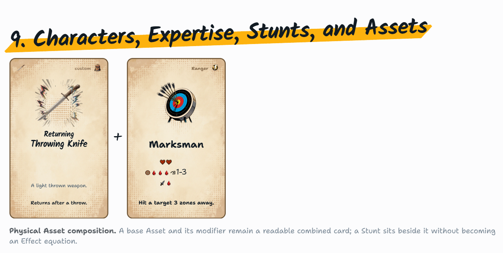
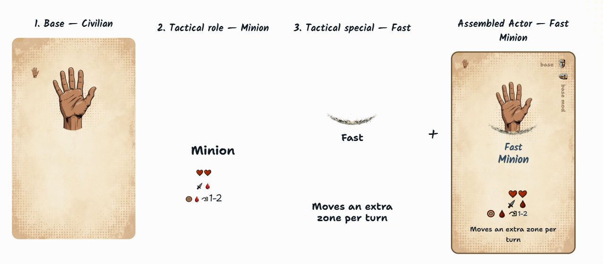
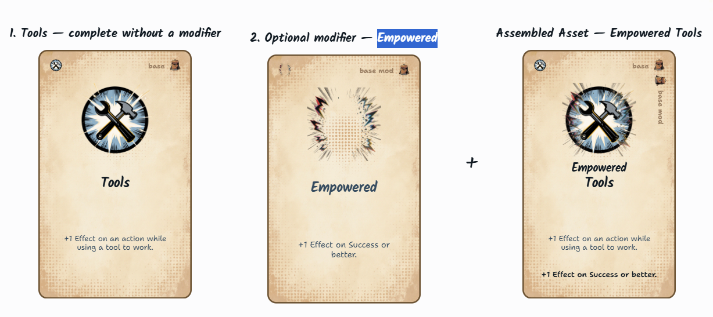

There are still issues on http\://localhost:5173/rules

Description icons on Actor cards are too small\
\
Compare this example of 2. Tactical role Minion  with the assembled card on the right. The 2. example is incorrect. The position and size does not match the complete example. This is likely a problem of the Components repo. Setup a temporary hidden route in this repo where a comparison between the elements from Components and Storyteller repo is shown side by side to catch inconsistencies.\
\
\

Asset overlay examples have background, but should be transparent (e.g. Empowered). Empowered title text is wrong color\

## Resolution checklist

Tracked by the [card parity implementation plan](2026-09-18-rules-ui-card-parity.md). Renderer ownership, the temporary `/__dev/card-parity` URL, and its cleanup condition are documented in [Mighty Decks rules](../11-mighty-decks-rules.md).

- [x] Capture the original rendering differences and measurements under `.agent-logs/rules-card-parity/`.
- [x] Correct shared Actor icon sizing and standalone/assembled layer geometry upstream; save browser and semantic regression evidence in the Components checkout under `.agent-logs/actor-parity/`.
- [x] Use canonical package rendering for generic teaching cards and transparent Asset modifiers, retaining local custom-card compatibility paths.
- [x] Add the hidden development comparison route with explicit renderer labels; shared delegates are adapter smoke checks.
- [x] Review local Components commit `82fec13afbea3062e672debdf8f1f42a1827217b`; pass its 56 tests, build, 1,059-PNG release generation, and distribution checks.
- [x] Pass all 174 Storyteller frontend tests, typechecking, and the production build.
- [x] Complete preliminary browser validation against the local candidate through a temporary alias (204 checks), inspect the rendered two-page PDF, and verify production route exclusion.
- [x] Publish and install Components `82fec13afbea3062e672debdf8f1f42a1827217b` through the normal dependency workflow; verify the lockfile revision, installed renderer hash, frozen install, and consumer checks.
- [x] Save final desktop, narrow-screen, and print evidence against the installed revision; pass all 204 development browser checks and 28 production checks, including route exclusion and resource/console health.
- [x] Visually inspect the final production PDF: two clean pages without clipping and with correct overlay backgrounds; rendered development PDF page hashes match production. Inspect final desktop Actor/Asset, narrow Actor, dark Empowered, and Marksman comparison screenshots.

The original screenshots and report above remain as baseline evidence. Final installed-package reports are saved under `.agent-logs/rules-card-parity/` as `final-installed-v1-report.json` and `production-installed-v1-report.json`. Candidate alias evidence remains separately identified.

The temporary route intentionally remains available for user review. After acceptance of the integrated visual result, follow-up cleanup removes the route, page/CSS, lazy import, and temporary URL documentation while preserving upstream regression coverage. This cleanup is not an implementation completion gate.
